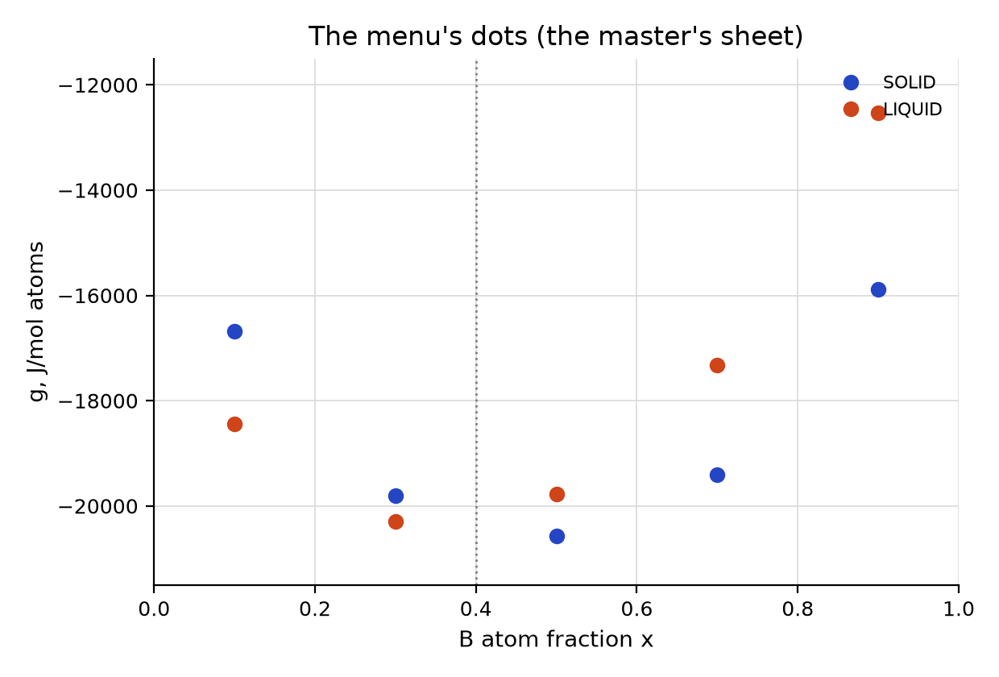
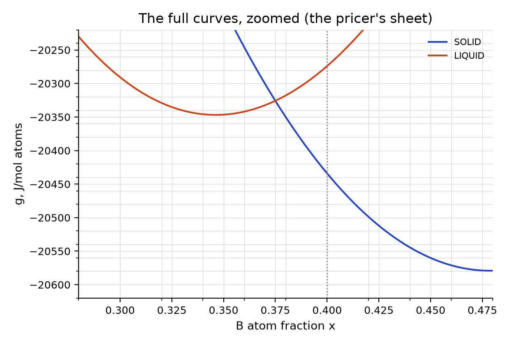

# Advanced steps 07–18: the column-generation game

For two players or two teams. The **master** holds the dots and draws a line;
the **pricer** holds the full curves and offers a state below the line, or
says “none”. Then swap roles. You need this sheet, a transparent ruler (the
“line”) and a pencil.

**Rules.**

1. The master marks the sample at $z=0.40$, chooses the cheapest
   mixture of the dots on the master's sheet (lever rule), and lays the ruler
   through the two used dots. The master announces the line's heights at
   $x=0$ and $x=1$.
2. The pricer's sheet is zoomed to $x$ from 0.28 to 0.48. The pricer works
   out the line's height at both edges, $\mu_A+\Delta\mu\,x$ (with
   $\Delta\mu=\mu_B-\mu_A$), draws the line there with the ruler, and
   looks for any point of the curves below it. If there is one, the pricer
   names its composition and phase model; the master adds it as a new dot.
3. Repeat until the pricer says “none”. Write down the ceiling (the master's
   best mixture) after every round.
4. Debrief: how did you know when to stop? How far below the ruler was the
   deepest point the pricer found in the first round?

**For the debrief.** First round: the master's line has $\mu_A=-19873.9$
and $\mu_B=-21262.9$; the deepest point below it is SOLID near
0.45, $-61.2$
J/mol atoms. The true answer is $-20473.12$.
