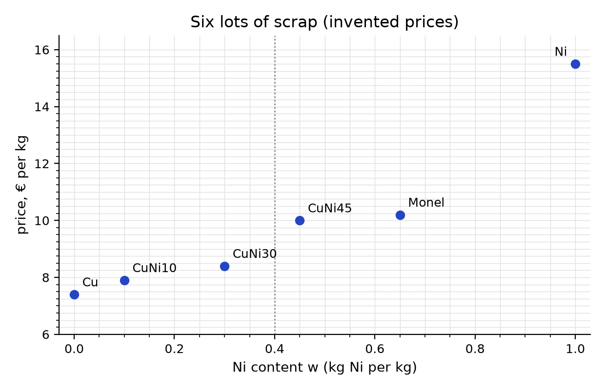
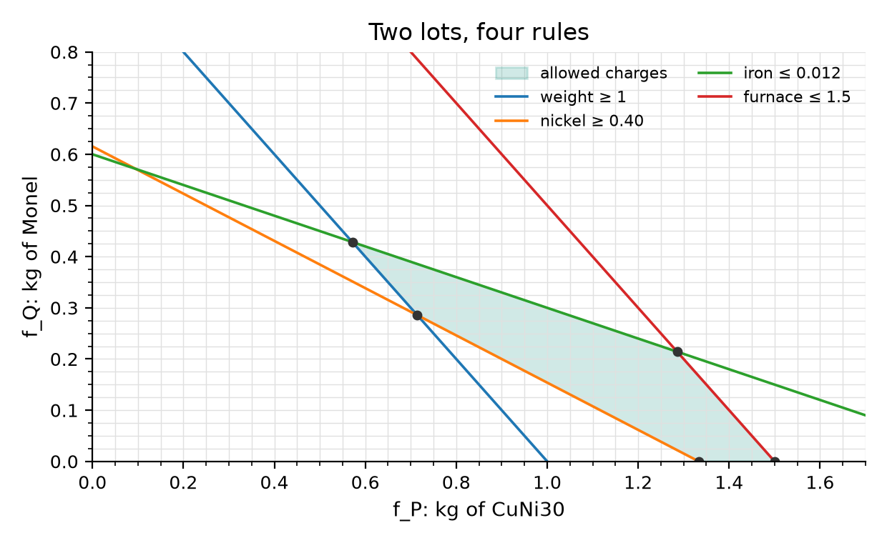

# Linear programmes: a primer sheet

The paper version of the optional LP primer of the self-study website (before
step 10). It needs a pencil, a ruler and a calculator. The prices, contents
and caps are invented for the exercise; they are not market data. Amounts are
kilograms and contents are mass fractions; step 10 uses moles of atoms and atom
fractions, and the recipe is the same.

## 1. Three parts

A melt shop must make 1 kg of a copper–nickel alloy with exactly 0.40 kg of
nickel in it, as cheaply as possible, from these lots:

| Lot | Ni content w (kg Ni per kg) | Price (€ per kg) |
|---|---|---|
| Copper scrap (Cu) | 0.00 | 7.40 |
| CuNi10 scrap | 0.10 | 7.90 |
| CuNi30 scrap | 0.30 | 8.40 |
| Constantan scrap (CuNi45) | 0.45 | 10.00 |
| Monel offcuts | 0.65 | 10.20 |
| Nickel cathode (Ni) | 1.00 | 15.50 |

Every linear programme (LP) has three parts:

- **Choose** the amounts $f_j \ge 0$ of each lot, in kg (the variables);
- **to make** the total cost $\sum_j f_j c_j$ as small as possible (the objective);
- **while keeping** the rules $\sum_j f_j = 1$ and $\sum_j f_j w_j = 0.40$ (the constraints).

Books, papers and software write it in one line: minimise $\sum_j f_j c_j$
**subject to** $\sum_j f_j = 1$, $\sum_j f_j w_j = 0.40$, $f_j \ge 0$.
"Subject to" means "while keeping these rules". A choice that keeps every rule
is *feasible*; any feasible choice with the lowest total is *optimal*. *Linear*
means that the total and every rule are sums of amounts times fixed numbers.

## 2. Dots and chords

1. Which lots have less nickel than 0.40, and which more? Use the lever rule
   on CuNi10 and CuNi30: why can this pair not make 0.40?
2. With a ruler, join Cu and Ni cathode, Cu and Monel, CuNi30 and Monel. Read
   each line's height at 0.40, then check it with the lever rule.
3. Which of the nine possible pairs is cheapest? How many lots does it use?

## 3. How a computer searches

Start from Cu and Ni cathode. Draw the line through the two used lots. The lot
furthest below the line (measured straight down, in €) comes in; the used lot on the same side of 0.40 goes
out. Repeat until no lot lies below the line.

| Round | Used pair | Cost (€ per kg) | Lot furthest below the line | Swap |
|---|---|---|---|---|
| 1 | Cu + Ni cathode | | | |
| 2 | | | | |
| 3 | | | | |

## 4. Prices and a floor

1. Extend the final line to $w = 0$ and $w = 1$. What is 1 kg of copper worth
   in this charge, and 1 kg of nickel? Why is the nickel cathode not used?
2. Nudge the target from 0.40 to 0.41. Predict the new cost from the line's
   slope. For which targets does this price hold?
3. Explain in two sentences why no charge at 0.40 can cost less than the
   line's height there.
4. A dealer offers swarf at $w = 0.50$ for €9.20. Is it worth buying? Answer
   from the line, without solving again.

## 5. The textbook picture

Now only two lots, CuNi30 (amount $f_P$) and Monel (amount $f_Q$), with
"at least" and "at most" rules: the charge weighs at least 1 kg; it holds at
least 0.40 kg nickel ($0.30 f_P + 0.65 f_Q \ge 0.40$); at most 0.012 kg iron
($0.006 f_P + 0.020 f_Q \le 0.012$); the furnace holds at most 1.5 kg; no amount
is negative.

The five corners of the allowed polygon:

| Corner $(f_P, f_Q)$, kg | Tight rules | Cost (€) |
|---|---|---|
| (0.714, 0.286) | weight, nickel | |
| (0.571, 0.429) | weight, iron | |
| (1.286, 0.214) | iron, furnace | |
| (1.500, 0) | furnace, no Monel | |
| (1.333, 0) | nickel, no Monel | |

1. Fill in the cost $8.40 f_P + 10.20 f_Q$ at each corner.
2. Draw the cost line $8.40 f_P + 10.20 f_Q = 9.00$. Slide it, parallel, to
   lower cost until it is about to leave the polygon. Which corner does it
   touch last?
3. Which rules have room to spare at that corner? What is their price? (A rule's
   price is how much the best cost changes when the number on its right-hand
   side moves by one unit.)
4. The iron cap becomes 0.005 kg. What happens?

## 6. Same problem, new names

| This sheet | Step 10 onwards |
|---|---|
| a lot of scrap | a state: one phase model at one composition |
| nickel content $w$ | B atom fraction $x$ |
| price $c$, € per kg | molar Gibbs energy $g$, J/mol atoms |
| weight and nickel rules | all atoms and all B atoms are kept |
| worth of 1 kg Cu and 1 kg Ni | $\mu_A$ and $\mu_B$ |
| price of nickel content | $\Delta\mu = \mu_B - \mu_A$ |
| a new offer below the line | a missing state found by pricing |

One difference: costs add because lots are bought and melted separately. A
mixture of menu dots adds energies the same way, as a real sample of separate
regions (boundary energy ignored), so the truth is at or below it: a ceiling.
It need not be the truth, because states between the dots are missing: if the
atoms of two dots of one phase model form one phase at the average composition,
its energy lies on that phase's curve, which can lie below the chord.

## Answers (after your attempt)

**2.1** Cu, CuNi10 and CuNi30 lie below 0.40; Constantan, Monel and Ni cathode
above. For CuNi10 and CuNi30 the lever rule asks for 1.5 kg CuNi30 and
−0.5 kg CuNi10: a negative amount cannot be bought.

**2.2** Cu + Ni cathode: 0.600 + 0.400 kg, €10.64. Cu + Monel: 0.385 + 0.615 kg,
€9.12. CuNi30 + Monel: 0.714 + 0.286 kg, €8.91.

**2.3** CuNi30 + Monel, €8.914 per kg. Two lots, and no more are needed: a
three-lot charge at 0.40 is a mixture of two-lot charges, each at 0.40, and the
cheaper of those costs no more than the mixture.

**3** Round 1: Cu + Ni cathode, €10.64; Monel lies 2.47 below; Monel in, Ni
cathode out. Round 2: Cu + Monel, €9.12; CuNi30 lies 0.29 below; CuNi30 in, Cu
out. Round 3: CuNi30 + Monel, €8.91; no lot below the line: done.

**4.1** The line's ends: €6.86 at $w = 0$ and €12.00 at $w = 1$. In this charge
1 kg Cu is worth €6.86 and 1 kg Ni €12.00. Ni cathode costs €15.50, more than
it is worth here.

**4.2** The slope is 5.14 € per unit of content, so the cost rises by
$5.143 \times 0.01 = 0.051$ € to €8.966. The price holds while CuNi30 and Monel
stay in use: targets between 0.30 and 0.65. At 0.30 and 0.65 themselves the
target sits on a used lot, and the rates on either side differ.

**4.3** Every lot costs at least the line's height at its own content. A charge
is a mixture of lots whose amounts add to 1 kg and whose nickel adds to 0.40 kg,
so it costs at least the line's height at 0.40, €8.914.

**4.4** The line's height at 0.50 is €9.43; the swarf lies €0.23 below it, so it
is worth buying. Half CuNi30 and half swarf cost €8.80.

**5.1** €8.91, €9.17, €12.99, €12.60, €11.20.

**5.2** The corner (0.714, 0.286), €8.914: the same charge as in part 2.

**5.3** The iron and furnace rules; their price is zero. The weight rule costs
€6.86 per kg, the nickel rule €5.14 per kg of nickel: the line's two numbers.
More nickel in the same weight swaps copper (€6.86) for nickel (€12.00), so
$12.00 - 6.86 = 5.14$.

**5.4** No charge keeps every rule: the problem is infeasible, and a solver says
so instead of giving an answer.
