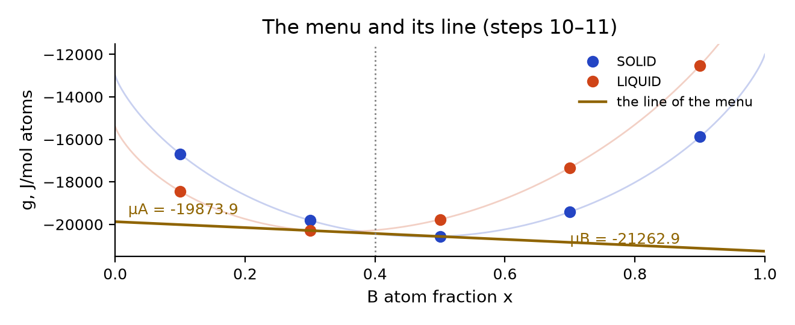
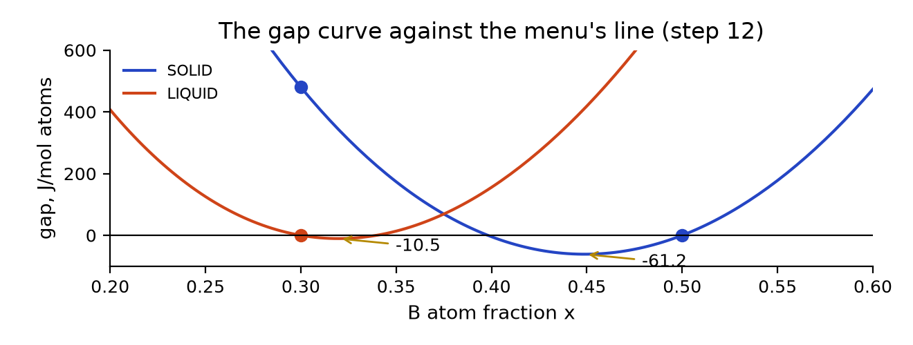
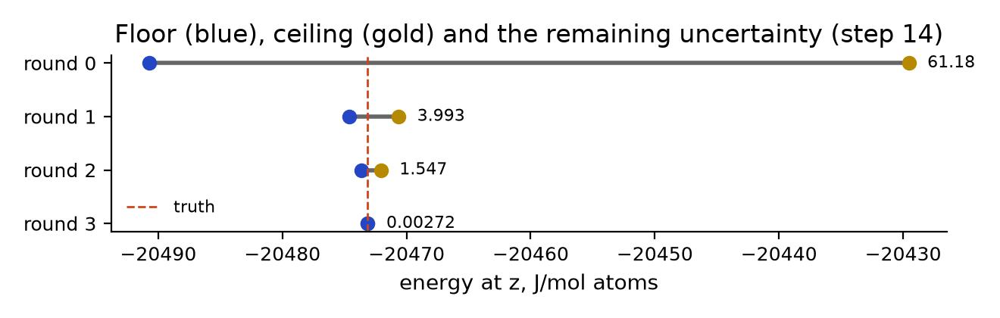
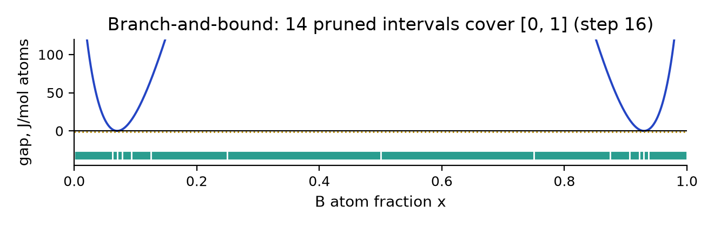

# Advanced steps 07–18: the picture sheet

One page to keep beside the advanced steps 07–18. All energies are J/mol of atoms.

**The menu and its line.** At $z=0.40$ the cheapest mixture of the
menu uses LIQUID at 0.3 and SOLID at 0.5, at $-20429.54$. The line
through them lies under every dot: a floor for the menu. Its end heights are
$\mu_A=-19873.9$ and $\mu_B=-21262.9$.

**The gap curve.** Energy minus the line. Used dots sit at zero; the curves
dip below it between the dots, deepest at SOLID near 0.4489
($-61.2$).

**Ceiling and floor.** The ceiling is the best mixture found; the floor is the
line slid down by the deepest dip. The truth, $-20473.12$, lies
between them; their distance is the remaining uncertainty.

**Branch-and-bound.** On the regular solution at 800 K every interval of
$[0,1]$ has a floor of at least $-1$ against the final line:
no valley deeper than the tolerance is left. Floor $-5585.53$,
ceiling $-5585.11$.
