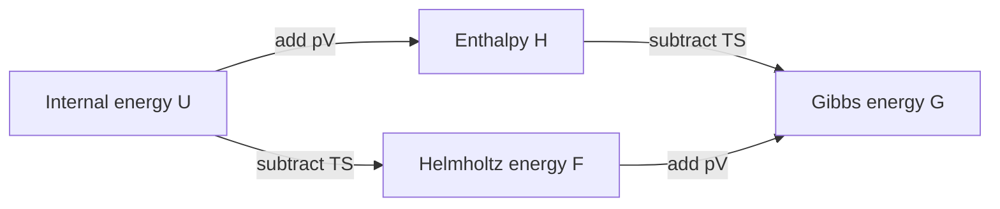

# Lesson 0 — internal energy, enthalpy and the two free energies

Start here. You need arithmetic, units and the idea that a material can be solid
or liquid. You do not need calculus, Python or previous CALPHAD experience.
Work through one short section at a time. Try each pause before opening its
answer; there is no need to finish all sections in one sitting.

Our question will eventually be: **at a specified temperature and pressure,
which phase is favored?** First we need to know which energy to compare.

## 0.1 Choose the piece of matter we are discussing

Imagine a sealed sample in a furnace. Call the sample the **system**. The furnace
and everything outside the sample are its **surroundings**. The boundary tells
us what can pass between them.

| Situation | Can matter cross? | Can energy cross? |
|---|---|---|
| Open system | Yes | Yes |
| Closed system | No | Yes, as heat or work |
| Isolated system | No | No |

“Closed” does not mean “thermally insulated.” Our sealed sample can receive heat
while keeping the same atoms. We will also specify whether its temperature,
pressure or volume is held fixed. Those conditions affect the equilibrium rule.

**Pause:** a sealed sample receives heat from a furnace. Is it isolated?

Answer

No. It is closed to matter, but energy crosses its boundary.

## 0.2 Internal energy U: an energy of the sample

The usual English term is **internal energy**; “inner energy” refers to the same
idea. $U$ includes microscopic energy associated with the material's particles
and their interactions. We account separately for motion or height of the whole
sample. Internal energy is a **state function**: its value is determined by the
state, rather than by the route used to reach that state.

For a closed sample at rest, write the first law using work **on** the sample as
positive:

$$\Delta U=q+w_{\mathrm{on}}.$$

Here $q$ is energy transferred as heat; $w_{\mathrm{on}}$ is energy transferred
as work. Heat and work describe transfers along a process. They are not extra
state functions stored alongside $U$. Another book may use work **by** the
sample and write a minus sign; first identify its convention. [1]

**Worked arithmetic:** the sample receives 100 J of heat and does 30 J of work
on its surroundings. Then $q=100$ J, $w_{\mathrm{on}}=-30$ J, and
$\Delta U=70$ J.

**Pause:** if two routes reach the same final state from the same initial state,
must they transfer the same heat?

Answer

No. They have the same $\Delta U$, but heat and work can differ while their sum
remains the same. For example, $q=80$ J and $w_{\mathrm{on}}=-10$ J also give 70 J.

## 0.3 Enthalpy H: include the pressure–volume term

Define **enthalpy** by

$$H=U+pV.$$

$p$ is pressure and $V$ is volume. The product has energy units:
$1\ \mathrm{Pa\,m^3}=1\ \mathrm{J}$. This definition does not create another
independent store of energy; it combines existing state quantities. [2]

Why is it useful? For a closed sample at constant pressure, with only
pressure–volume work and mechanical equilibrium with that pressure,
$w_{\mathrm{on}}=-p\Delta V$. Then the first law gives

$$\Delta H=\Delta U+p\Delta V=q_p.$$

The subscript means heat along this constant-pressure process. Enthalpy itself
is not “the heat in the sample.” Electrical work, changing pressure or matter
transfer require additional accounting.

**Worked arithmetic:** suppose $U=999$ J, $p=100000$ Pa and
$V=10^{-5}$ m$^3$. Then $pV=1$ J and $H=1000$ J. These invented values will
help us check the definitions; they are not measurements of an alloy.

**Pause:** may we replace $H$ by $U$ in every material calculation?

Answer

No. Their difference is $pV$. It is small in this numerical example, but an
approximation must be justified for the quantity and conditions being compared.

## 0.4 Entropy S: why internal energy alone does not select the state

Entropy is a state function with units J/K. For a reversible heat-transfer step,

$$dS=\frac{\delta q_{\mathrm{rev}}}{T}.$$

$T$ is absolute temperature in kelvin. The small-step symbols can wait for a
later lesson: here they say that a reversible heat input divided by temperature
gives an entropy change. For a finite reversible transfer at constant $T$,
$\Delta S=q_{\mathrm{rev}}/T$. For an irreversible process, dividing the actual
heat by $T$ need not give the system's entropy change. [3]

Entropy also has a microscopic interpretation in terms of accessible microscopic
states. “Disorder” alone is too vague to calculate it. For now, we will supply
entropy values and use their units and thermodynamic meaning.

The second law concerns the system **and surroundings together**: their total
entropy cannot decrease in a spontaneous process when the combined whole is
isolated. The sample's entropy alone can decrease when it transfers heat out. [3]

**Pause:** does a liquid becoming a more ordered solid necessarily violate the
second law?

Answer

No. Account for heat transferred to the surroundings and their entropy change.
Looking only at the sample is insufficient.

## 0.5 “Free energy” needs a first name

Two common quantities carry that name:

$$F=U-TS\quad\text{(Helmholtz energy)},$$

$$G=H-TS=U+pV-TS\quad\text{(Gibbs energy)}.$$

Helmholtz energy is also written $A$. “Gibbs free energy” and “Gibbs energy”
refer to the same quantity. A text that says only “free energy” has left you to
identify which one it means. Here we always say Helmholtz or Gibbs. [4,5]

Because entropy has units J/K, $TS$ has units J. The subtraction is dimensionally
consistent. The adjective “free” does not mean energy appears without cost;
these combinations account for thermal constraints when comparing states.

The four quantities are related:

If the diagram is unavailable, read the same relations as $H=U+pV$,
$F=U-TS$, and $G=H-TS=F+pV$.

**Pause:** are $F$ and $G$ interchangeable symbols for the same state function?

Answer

No. $G-F=pV$. $A$ and $F$ are alternative symbols for Helmholtz energy;
$G$ names Gibbs energy.

## 0.6 Calculate all four for one state

Keep the invented sample from section 0.3. Now give it $T=300$ K and $S=10$ J/K.
Do one multiplication and then one subtraction per row.

| Calculation | Result |
|---|---|
| Given internal energy | $U=999$ J |
| $pV=100000\times10^{-5}$ | $1$ J |
| $H=999+1$ | $1000$ J |
| $TS=300\times10$ | $3000$ J |
| $F=999-3000$ | $-2001$ J |
| $G=1000-3000$ | $-2000$ J |
| Cross-check: $G-F$ | $1$ J, equal to $pV$ |

A negative Gibbs energy is not a mistake. The energy reference matters. To choose
between phases, we compare consistently referenced states containing the same
amounts of each component under the same imposed conditions. The sign of $G$
by itself does not tell us which state wins.

**Pause:** which is lower: $-2000$ J or $-1800$ J? How large is the difference?

Answer

$-2000$ J is lower by 200 J. A negative number with larger magnitude is lower.
That ordering will matter when we compare phase energies.

## 0.7 Which quantity chooses equilibrium?

For the simple bulk systems here, keep each component's total amount fixed and
exclude additional electrical, magnetic, surface or elastic work constraints.
Then use the row matching the surroundings: [4]

| Imposed conditions | Equilibrium criterion among allowed states |
|---|---|
| Isolated: fixed $U,V$ and component amounts | Maximum entropy $S$ |
| Fixed $T,V$ and component amounts | Minimum Helmholtz energy $F$ |
| Fixed $T,p$ and component amounts | Minimum Gibbs energy $G$ |

The furnace example will use fixed $T,p$: compare Gibbs energies. Enthalpy alone
can give the wrong phase ordering because it omits the entropy term. Equilibrium
identifies the favored state; it does not tell us how quickly that state forms.
Diffusion and nucleation can make an observed sample persist in another state.

**Pause:** a calculation holds temperature and volume fixed. Should you select
a state just because its Gibbs energy is the lowest?

Answer

For this simple closed system, compare Helmholtz energy under those constraints.
Choosing the potential starts with identifying what is held fixed.

## 0.8 Total quantities and quantities per mole

$G$ is the energy of the whole sample in J. We write $g=G/n$ for energy per mole,
in J/mol, where $n$ is the amount in moles. Similarly, $h=H/n$ and $s=S/n$.
For a homogeneous sample, $G=ng$ and $g=h-Ts$. One mole throughout these opening
examples means one mole of atoms. Symbols are not universal: many CALPHAD outputs
use `GM` for molar Gibbs energy. Always check the units.

**Pause:** if $g=-8000$ J/mol, what is $G$ for two moles?

Answer

$G=2\times(-8000)=-16000$ J. Do not compare this total directly with a one-mole
energy to choose a phase; compare the same amount or use molar energies.

## 0.9 The example we will carry into code

Consider one invented component that can form `SOLID` or `LIQUID`. At a fixed
pressure of 100000 Pa, give each phase a constant molar enthalpy and entropy:

| Phase | $h$, J/mol | $s$, J/(mol K) | $g=h-Ts$, J/mol |
|---|---:|---:|---|
| SOLID | 1000 | 10 | $1000-10T$ |
| LIQUID | 7000 | 16 | $7000-16T$ |

These numbers are entirely synthetic. We will use them only from 800 to 1200 K
at this pressure. Constant $h,s$ give zero heat capacity within each modeled
phase; that deliberate simplification lets us see the method with straight
lines. It does not describe a real element or its behavior outside this interval.
The earlier 300 K arithmetic was a single-state illustration, not an extension
of this phase model.

At 900 K, calculate each line separately:

$$g_S=1000-900\times10=-8000\ \mathrm{J/mol},$$
$$g_L=7000-900\times16=-7400\ \mathrm{J/mol}.$$

The solid has lower Gibbs energy, by 600 J/mol. At 1100 K, the values become
$-10000$ and $-10600$ J/mol: now the liquid is lower. Its larger entropy makes
the $-Ts$ contribution decrease more rapidly as temperature rises.

**Pause:** at what temperature are the two Gibbs energies equal?

Work it out one step at a time

Start with $1000-10T=7000-16T$. Add $16T$ to both sides, then subtract 1000:
$6T=6000$. Thus $T=1000$ K and both phases have $g=-9000$ J/mol.
At this crossing, the imposed temperature and pressure alone do not select a
unique solid/liquid fraction. We will return to that point in code. [6]

## Before moving on

Explain aloud: what distinguishes heat from $U$; how $H$ relates to $U$; what
the two free energies are; which one applies at fixed $T,p$; and why the liquid
can win at high temperature despite having the larger enthalpy.
If one answer is unclear, revisit that section. Completing the arithmetic is
only part of the exercise. The next lesson will repeat these same numbers using
ordinary Python/NumPy before introducing any thermodynamic database.

**Optional stretch:** add the same 500 J/mol to both phase enthalpies. The
crossing temperature is unchanged because the difference is still $6000-6T$.
Adding 500 J/mol to only one phase changes the model and generally the crossing.

## Sources and further reading

The explanations and examples here are original. These sources support the
standard definitions and equilibrium conditions; no school material is required.

[1] R. Jaramillo, “Process Variables and the First Law,” *MIT 3.020*, Lecture 3,
2021. [Official notes](https://ocw.mit.edu/courses/3-020-thermodynamics-of-materials-spring-2021/mit3_020s21_l03.pdf).

[2] IUPAC, “Enthalpy,” *Gold Book*, doi:
[10.1351/goldbook.E02141](https://doi.org/10.1351/goldbook.E02141).
[Definition](https://goldbook.iupac.org/terms/view/E02141/pdf).

[3] R. Jaramillo, “Second Law and Entropy Maximization,” *MIT 3.020*, Lecture 5,
2021. [Official notes](https://ocw.mit.edu/courses/3-020-thermodynamics-of-materials-spring-2021/mit3_020s21_l05.pdf).

[4] R. Jaramillo, “Thermodynamic Potentials,” *MIT 3.020*, Lecture 6, 2021.
[Official notes](https://ocw.mit.edu/courses/3-020-thermodynamics-of-materials-spring-2021/mit3_020s21_l06.pdf).

[5] IUPAC, “Gibbs energy,” *Gold Book*, doi:
[10.1351/goldbook.G02629](https://doi.org/10.1351/goldbook.G02629).
[Definition](https://goldbook.iupac.org/terms/view/G02629).

[6] R. Jaramillo, “Introduction to Unary Phase Transformations,” *MIT 3.020*,
Lecture 10, 2021. [Official notes](https://ocw.mit.edu/courses/3-020-thermodynamics-of-materials-spring-2021/mit3_020s21_l10.pdf).
The MIT notes list no DOI. Read only what helps with the current section.
