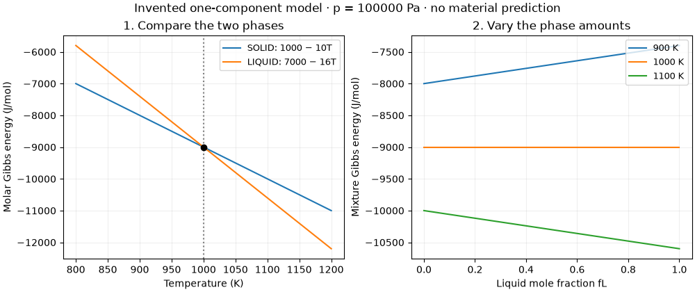

# Lesson 1 — calculate a phase change with plain code

Read [Lesson 0](lesson_00.md) first. We keep exactly the same invented material,
numbers and question: **at this temperature and pressure, is solid or liquid
favored?** There is only one component, so we do not yet need composition,
mixing entropy, chemical potentials or a common tangent.

Take sections 1.1–1.4 first. Return to the optimizer in a second sitting if the
phase comparison is still new. The [setup instructions](README.md#running-the-examples)
explain how to start Python. Run the Python blocks below in order in the same
session. The complete [plain-code script](one_component_manual.py) is also runnable.

## 1.1 Recall the physical problem

We have one mole of invented atoms A at pressure 100000 Pa. At each chosen
temperature we let the amount of solid and liquid adjust. The sample is closed:
the total amount stays one mole. Surface energies and kinetics are omitted.
Our [model contract](one_component_contract.md) restricts this example to
800–1200 K and this one pressure.

| Phase | h, J/mol | s, J/(mol K) | g=h−Ts, J/mol |
|---|---:|---:|---|
| SOLID | 1000 | 10 | 1000−10T |
| LIQUID | 7000 | 16 | 7000−16T |

All parameters are synthetic. Constant h and s make straight lines and imply
zero heat capacity within each modeled phase. They simplify the exercise;
they do not describe a real element.

## 1.2 Type one calculation, not a solver

```python
T = 900.0                  # K
g_solid = 1000.0 - 10.0 * T  # J/mol
g_liquid = 7000.0 - 16.0 * T # J/mol
print(g_solid, g_liquid)
print(g_liquid - g_solid)
```

The first line of output is `-8000.0 -7400.0`; the second is `600.0`.
The solid is lower by 600 J/mol. `=` assigns a value to a Python name. `*`
means multiplication. A name such as `g_solid` is simply a place to keep a
number; Python does not know its physical units, hence the comments.

**Pause:** change T to 1100 K and repeat. Which phase is lower?

<details><summary>Answer</summary>

The energies are −10000 and −10600 J/mol; liquid is lower. Keep kelvin and
J/mol throughout. Typing 1100 degrees Celsius as 1100 K changes the conditions.

</details>

## 1.3 Repeat the arithmetic with NumPy

An array lets the same expression operate on several temperatures at once.
It changes the convenience of the calculation, not the model.

```python
import numpy as np

temperatures = np.array([800.0, 900.0, 1000.0, 1100.0, 1200.0])
solid = 1000.0 - 10.0 * temperatures
liquid = 7000.0 - 16.0 * temperatures
lowest = np.minimum(solid, liquid)
print(np.column_stack([temperatures, solid, liquid, lowest]))
```

`np.minimum` compares the two entries at each temperature. `column_stack`
places the arrays beside one another so you can read a table:

| T, K | gSOLID, J/mol | gLIQUID, J/mol | Lower g, J/mol |
|---:|---:|---:|---:|
| 800 | −7000 | −5800 | −7000 |
| 900 | −8000 | −7400 | −8000 |
| 1000 | −9000 | −9000 | −9000 |
| 1100 | −10000 | −10600 | −10600 |
| 1200 | −11000 | −12200 | −12200 |

**Pause:** the higher line is still in the table. Why keep it?

<details><summary>Answer</summary>

It lets us check both phase models and find where their ordering changes.
Displaying only the lower energy would hide a wrong expression for the other
phase. An allowed phase model can be evaluated even when that phase is not
the equilibrium choice.

</details>

## 1.4 Read the curves, then locate the crossing



[Download the vector figure](figures/one_component_gibbs.svg).

Look only at the **left panel** for now. The liquid line falls more steeply
because its entropy is larger. Below 1000 K the solid line is lower; above
1000 K the liquid line is lower. The dot marks equal energies.

We already solved $1000-10T=7000-16T$ by hand: $T=1000$ K. A numerical
root finder can locate the zero of their difference:

```python
from scipy.optimize import brentq

def difference(T):
    return (7000.0 - 16.0*T) - (1000.0 - 10.0*T)

crossing = brentq(difference, 800.0, 1200.0)
print(crossing)
```

Output: `1000.0`. `def` defines a function: provide T and get the difference
back. The difference is positive at 800 K and negative at 1200 K, so those
endpoints bracket a crossing. `brentq` searches inside the bracket. It is
finding a root in temperature, not fitting h and s. [1]

**Pause before continuing:** can you explain why one phase is favored at 900 K
and the other at 1100 K without referring to Python?

<details><summary>Expected explanation</summary>

At fixed T and p we compare consistently referenced Gibbs energies for the same
amount of matter. Solid has the lower value at 900 K; liquid at 1100 K. The
larger liquid entropy changes the balance as temperature increases. The plot
does not tell us how long melting or solidification takes.

</details>

## 1.5 What would an equilibrium optimizer vary?

At a fixed temperature, let $f_L$ be the fraction of atoms in liquid. Because
we have one component and conserve its amount, $f_S=1-f_L$. Both are mole/atom
fractions, not automatically image-area or volume fractions.

The total Gibbs energy divided by the total amount is

$$g_{\mathrm{mixture}}=(1-f_L)g_S+f_Lg_L,\qquad 0\le f_L\le1.$$

This is a mixture of macroscopic **phases of one component**. It is not an
atomic solution of two different elements, so there is no compositional mixing
term here. We neglect the interface between solid and liquid.

At 900 K the expression is $-8000+600f_L$: increasing the liquid fraction raises
the energy. Try five amounts directly:

```python
liquid_fractions = np.array([0.0, 0.25, 0.5, 0.75, 1.0])
mixture = (1.0-liquid_fractions)*(-8000.0) + liquid_fractions*(-7400.0)
print(np.column_stack([liquid_fractions, mixture]))
```

The energies are −8000, −7850, −7700, −7550 and −7400 J/mol. The minimum is
all solid. Now the **right panel** of the figure is useful: its 900 K line
rises with liquid fraction; its 1100 K line falls.

**Pause:** can a fraction of −0.2 give a lower numerical value at 900 K?
Would that be a valid equilibrium?

<details><summary>Answer</summary>

The line would give −8120 J/mol, but a negative phase amount is impossible.
An optimizer must obey physical constraints as well as lower the objective.

</details>

## 1.6 Give those exact quantities to SciPy

An **objective** is the quantity to minimize. **Variables** are the numbers the
optimizer may change. **Constraints** specify what those numbers must obey.

| Mathematical role | Our physical quantity | Python argument below |
|---|---|---|
| Objective coefficients | gSOLID and gLIQUID at 900 K | `c` |
| Variables | fSOLID and fLIQUID | entries of `answer.x` |
| Amount balance | fSOLID + fLIQUID = 1 | `A_eq`, `b_eq` |
| Physical bounds | each fraction between 0 and 1 | `bounds` |

```python
from scipy.optimize import linprog

answer = linprog(
    c=[-8000.0, -7400.0],
    A_eq=[[1.0, 1.0]],
    b_eq=[1.0],
    bounds=[(0.0, 1.0), (0.0, 1.0)],
    method="highs",
)
if not answer.success:
    raise RuntimeError(answer.message)

print(answer.x)    # solid fraction, liquid fraction
print(answer.fun)  # minimized Gibbs energy, J/mol
```

The answer is all solid and −8000 J/mol, agreeing with the hand calculation.
The second fraction may print as `-0.`: floating-point signed zero has the value
zero. `linprog` solves a linear optimization problem; our objective and amount
balance are linear in the fractions. Check solver success before reading its
answer. [2]

**Pause:** which input values would you change to calculate equilibrium at
1100 K? Which stay the same?

<details><summary>Answer</summary>

Change the objective coefficients to `[-10000.0, -10600.0]`. The bounds and
amount balance stay the same. The minimum is all liquid, −10600 J/mol.
Changing h or s would change the material model, not just the temperature.

</details>

## 1.7 At the crossing, more than one answer is possible

At 1000 K both coefficients are −9000 J/mol, so

$$g_{\mathrm{mixture}}=(1-f_L)(-9000)+f_L(-9000)=-9000.$$

Every $f_L$ from 0 to 1 has the same energy. That is the flat line in the right
panel. A solver may return all liquid, all solid, or a mixture. Its particular
choice is not a uniquely determined fraction at these imposed T,p conditions.
An additional constraint, for example a specified total enthalpy in a different
physical problem, could select an amount; we have not imposed one.

**Pause:** two programs return different phase fractions at exactly 1000 K.
Does that alone establish a disagreement?

<details><summary>Answer</summary>

No. Check their energies, nonnegative amounts and conservation. Away from the
crossing, this particular model does have a unique preferred pure phase.

</details>

## 1.8 What part of CALPHAD have we demonstrated?

CALPHAD means **CALculation of PHAse Diagrams**. Its thermodynamic workflow uses
models for phase Gibbs energies and calculates equilibrium under specified
conditions. Developing and assessing model parameters against evidence is
another part of the method. [3]

We supplied two synthetic phase models, specified the allowed states and
conditions, and minimized total Gibbs energy while conserving matter. We did
not assess parameters against experiments. Real systems introduce composition,
more phases and additional model terms. We will add those gradually after
repeating this same calculation with a CALPHAD library.

**Two different optimization questions:** equilibrium varies phase amounts
(and later compositions) with model parameters fixed. Parameter fitting varies
model parameters to explain data. The optimizer above does the first task.

Run the complete plain route from the repository root:

```bash
poetry run python -m course.foundations.one_component_manual
```

Next: [Lesson 2 — repeat the same model in pycalphad](lesson_02_same_model_pycalphad.md).
Optional stretch: explain why adding a common linear-in-T reference to both
phases leaves their crossing unchanged. Subtract the two expressions to check.

## Sources

[1] SciPy developers, [`brentq` documentation](https://docs.scipy.org/doc/scipy/reference/generated/scipy.optimize.brentq.html).
[2] SciPy developers, [`linprog` documentation](https://docs.scipy.org/doc/scipy/reference/generated/scipy.optimize.linprog.html).
The example is executed with the repository's pinned versions, recorded in
[the saved result](one_component_result.json).

[3] U. R. Kattner, “The CALPHAD method and its role in material and process
development,” 2016, doi: [10.4322/2176-1523.1059](https://doi.org/10.4322/2176-1523.1059).
[NIST author record](https://www.nist.gov/publications/calphad-method-and-its-role-material-and-process-development).
Thermodynamic definitions and conditions are referenced in [Lesson 0](lesson_00.md).
