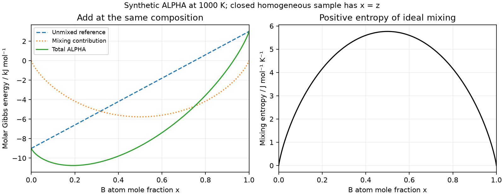

# Lesson 4 — add an ideal mixing contribution

Meetings 10–11, two 90-minute meetings. Prerequisites: molar G=H−TS at fixed T,p,
[composition and two-box balance](lesson_03_composition.md), and fractions.
No calculus or coding is required. Use the [worksheet](lesson_04_worksheet.md);
timing, hints and answers are in the [guide](../instructor/lesson_04_guide.md).

By the exit task, separate reference and mixing contributions, check pure limits,
and explain which comparisons keep the same closed sample. The numbers below
are invented teaching parameters, not predictions for an alloy.

## 4.1 State the sample before calculating

We now have two atom species A and B and one allowed structure called ALPHA.
This is a new binary model, not a physical extension of the earlier unary model.
Keep pressure 100000 Pa, temperature T between 600 and 1800 K, and total amount
n=1 mol of atoms. The overall B fraction is z. In a homogeneous sample, x=z.
The model ignores interfaces, strain, magnetism, reactions and kinetics.
ALPHA is a label; it does not specify a crystal structure of a real material.

At a chosen T, imagine first keeping A and B unmixed, each in ALPHA. Their molar
Gibbs energies are supplied by the [binary-family contract](binary_family_contract.md):

$$g_A=1000-10T,\qquad g_B=13000-10T\quad\text{J/mol}.$$

For x mol B and (1−x) mol A, the reference per mole of total atoms is
$g_{\rm ref}=(1-x)g_A+xg_B=1000+12000x-10T$.
The units of 10 here are J/(mol K), so 10T has units J/mol.
At 1000 K, x=0.5: gA=−9000, gB=3000 and gref=−3000 J/mol.
An energy can be negative relative to the declared reference; zero is not an
absolute physical ground state.

## 4.2 What mixing adds: arrangements, then a logarithm

Place two A and two B labels in four distinguishable positions. There are six
patterns: AABB, ABAB, ABBA, BAAB, BABA and BBAA. There is one all-A pattern.
This illustrates increased possible arrangements, not a quantitative entropy
calculation for four atoms. The macroscopic formula below is a model assumption;
we do not replace its mole-scale entropy by the logarithm of six.

The natural logarithm ln is the inverse of the exponential: ln(exp(y))=y.
For example, exp(0)=1 gives ln(1)=0. Values between zero and one have negative
logarithms. Use this card; you do not need to derive the logarithm today.

| u | 1 | 0.8 | 0.5 | 0.2 | 0.01 |
|---|---:|---:|---:|---:|---:|
| ln(u) | 0 | −0.22314355 | −0.69314718 | −1.60943791 | −4.60517019 |

Define $q(x)=(1-x)\ln(1-x)+x\ln x$. Both terms are negative inside (0,1).
For x=0.5, q=−0.69314718; for x=0.2, q≈−0.50040242.
The **ideal mixing** model sets

$$\Delta h_{\rm mix}=0,\qquad \Delta s_{\rm mix}=-Rq,\qquad
\Delta g_{\rm mix}=-T\Delta s_{\rm mix}=RTq,$$

where R=8.3145 J/(mol K), the declared rounded constant. Thus mixing raises
entropy and lowers Gibbs energy relative to the unmixed same-phase reference
at the same T,p,composition. Zero mixing enthalpy is an ideal-model assumption;
it does not say that unlike atoms have no interactions in every real material.

**Pause:** at x=0.5, should Δs be positive or negative? Which sign does −TΔs have?
Answer: positive entropy change, negative Gibbs-energy contribution.

## 4.3 Pure endpoints require a limit, not ln(0)

ln(0) is undefined. The product x ln x approaches zero as positive x approaches
zero: at x=0.01 it is about −0.046052, at x=0.0001 about −0.000921.
We define its endpoint by that limit. Both pure compositions have q=0, so all
mixing contributions vanish. This does **not** replace x by a small epsilon;
that would be a different composition. A naive computer expression `0*log(0)`
can produce NaN. The optional cell uses `xlogy` [1] to evaluate the zero limit.

## 4.4 Add contributions with their units

The reference enthalpy is href=1000+12000x J/mol and reference entropy is
sref=10 J/(mol K). Hence total h=href, total s=10+Δsmix, and g=h−Ts.
At T=1000 K, x=0.5:

| Quantity | Value | Unit |
|---|---:|---|
| href = total h | 7000 | J/mol |
| gref | −3000 | J/mol |
| Δsmix | 5.763172 | J/(mol K) |
| Δgmix | −5763.172 | J/mol |
| total g | −8763.172 | J/mol |
| total s | 15.763172 | J/(mol K) |

Totals and mixing changes are different columns. For n=2 mol at the same x,T,
total G=2g, H=2h and S=2s, while the molar values stay the same.



The figure holds T=1000 K. Add the reference and mixing ordinate at the **same x**
to obtain the total curve; do not add their minimum values at different x.
At x=0.2, total g≈−10760.596 J/mol, lower than at x=0.5. This does not let a
closed sample with z=0.5 become homogeneous x=0.2: that would change its A/B
inventory. For this ideal single-phase model, the balanced homogeneous state
x=z is equilibrium; the later curvature argument shows that splitting this
same structure cannot lower G. Today we check the formula and inventories,
not a general theorem that every solution remains homogeneous.

## 4.5 Optional exact calculation, after the paper table

Use the repository's existing Poetry environment and run this from its root.
Each output row is x, gref, Δgmix, total g (J/mol), total h (J/mol), total s
(J/(mol K)). Arrays collect several **different sample compositions**, not
simultaneous regions of one sample. The code exposes the formula first;
`binary_family.ideal_properties` applies the same expression with input checks.

```python
import numpy as np
from scipy.special import xlogy

T = 1000.0
R = 8.3145
x = np.array([0.0, 0.2, 0.5, 0.8, 1.0])
h = 1000.0 + 12000.0*x
gref = h - 10.0*T
q = xlogy(x, x) + xlogy(1-x, 1-x)
smix = -R*q
gmix = -T*smix
for row in zip(x, gref, gmix, gref+gmix, h, 10+smix):
    print(' '.join(f'{v:.6f}' for v in row))
```

Run the cell in the course notebook [f3](../../notebooks/f3_binary_mixing_potentials.ipynb) (section 2) or save just its Python contents
to `/tmp/ideal_mixing_cell.py` and run `poetry run python /tmp/ideal_mixing_cell.py`.
Expected central row: `0.500000 -3000.000000 -5763.172233 -8763.172233 7000.000000 15.763172`.
Expected pure-A row: `0.000000 -9000.000000 0.000000 -9000.000000 1000.000000 10.000000`;
a printed minus sign on zero is harmless. For paper-only delivery, use the table
and figure: programming is not a hidden prerequisite for the next meeting.

## Vocabulary and sources

Reference: weighted unmixed endmembers in the **same phase** at the same T,p.
Mixing change Δ: total minus that reference. Molar: per mole of all atoms.
Homogeneous: one uniform composition. Ideal: here zero enthalpy of mixing and
the supplied configurational entropy. No real-alloy validation follows.
The equations and constants are the original declared [binary-family model](binary_family_contract.md),
which cites its standard thermodynamic basis; the worked results follow directly
by substitution. The arrangement example is illustrative only.

[1] SciPy developers, “scipy.special.xlogy,” [official API documentation](https://docs.scipy.org/doc/scipy/reference/generated/scipy.special.xlogy.html),
accessed 28 September 2026; no DOI listed for this API page. It documents the
zero-product convention, not the physical ideal-solution assumption.
