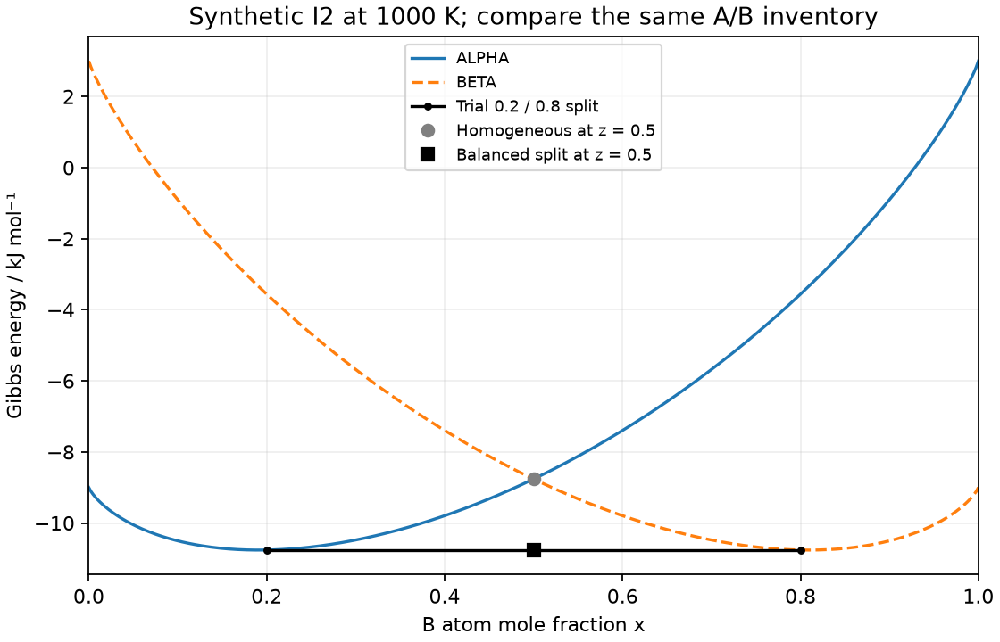

# Lesson 5 — compare balanced two-phase candidates

Meetings 12–13. Prerequisites: [composition](lesson_03_composition.md),
[ideal mixing](lesson_04_ideal_mixing.md) and weighted averages. No derivatives
or tangent construction yet. Use the [worksheet](lesson_05_worksheet.md) and
[instructor guide](../instructor/lesson_05_guide.md).

Exit goal: construct a feasible split, calculate its energy, infer amounts from
supplied compositions, and label a grid result's limitations. All examples are
original synthetic macroscopic bulk at fixed T,p, with no interface/strain cost.

## 5.1 Allow a second phase without changing the sample

Keep total n=1 mol of atoms, overall B fraction z, p=100000 Pa and 600≤T≤1800 K.
We now allow **both** ALPHA and BETA, model I2 in the [contract](binary_family_contract.md).
BETA is another invented phase model; neither phase name identifies a real
crystal structure. Each phase can contain both A and B. At 1000 K:

$$g_\alpha(x)=-9000+12000x+RTq(x),$$
$$g_\beta(x)=3000-12000x+RTq(x),$$

with R=8.3145 J/(mol K), q from Lesson 4. Each expression is J/mol of that
phase's atoms. For example, gβ(0.8)=gα(0.2) by reflection. Compare only states
with the same total A and B. A homogeneous state at another x is not an allowed
replacement unless a second region makes the overall balance correct.

A region r has phase amount fraction fr and B composition xr. Its contribution
to the sample's molar energy is fr gr. The sample's objective and balances are

$$g_{\rm sample}=\sum_r f_rg_r,\quad \sum_r f_r=1,\quad
\sum_r f_rx_r=z,\quad\sum_r f_r(1-x_r)=1-z,\quad f_r\ge0.$$

For total n other than one mole, G=n gsample. The amount fractions count atoms
in phases, not mass or area. Balance selects feasible states; then G ranks them.

## 5.2 A split can beat either homogeneous state at the same overall z

Worked at T=1000 K, z=0.5. Homogeneous ALPHA at x=0.5 has g=−8763.172 J/mol;
homogeneous BETA has the same value. Try half the atoms in ALPHA at xα=0.2 and
half in BETA at xβ=0.8. ALPHA contains 0.4 mol A+0.1 mol B; BETA contains 0.1 A+0.4 B.
Both totals remain 0.5 mol. Its energy is

$$g_{\rm split}=0.5(-10760.596)+0.5(-10760.596)=-10760.596\ \text{J/mol}.$$

This candidate is lower by 1997.424 J/mol. It disproves homogeneous equilibrium
at this z when both phases are allowed. It does not prove that 0.2/0.8 are the
best endpoints. A different balanced pair might be lower still.

**Pause:** is taking all atoms as ALPHA at x=0.2 acceptable because its energy is
low? No: its 0.2 mol B is not the required 0.5 mol. A phase's preferred composition
alone cannot represent an arbitrary closed sample.

## 5.3 The lever rule is a balance equation

For distinct supplied endpoints xα<xβ, substitute fα=1−fβ:

$$z=x_\alpha+f_\beta(x_\beta-x_\alpha),\qquad
f_\beta=\frac{z-x_\alpha}{x_\beta-x_\alpha},\qquad f_\alpha=1-f_\beta.$$

The farther z lies from xα toward xβ, the greater the amount in BETA. Draw the
composition axis and mark both endpoints **and** z before calculating.
For endpoints 0.2 and 0.8, z=0.35 gives fβ=0.25, fα=0.75. On one mole:
B=0.75×0.2+0.25×0.8=0.35; A=0.75×0.8+0.25×0.2=0.65.
Amounts are fractions of all atoms; endpoints describe atoms inside each phase.

If z=0.1 with these endpoints, fβ=−1/6. That is infeasible, not a small numerical
error to clip. Clipping fβ to zero would leave x=0.2 and the wrong inventory.
If endpoints coincide, balance cannot determine their amounts; the distinct-
endpoint formula is undefined. No division by zero or made-up equal fractions.
This rule determines amounts **given** endpoints, not which endpoints equilibrium
selects. An equilibrium tie line connects the selected coexisting compositions;
a line between arbitrary balanced candidates is only a trial segment.

## 5.4 A finite search makes the optimization visible

Choose a grid of compositions for each allowed phase. Each phase/grid point is
a possible region with known energy. Unknowns are its nonnegative amount
fractions. Minimize their weighted energy subject to total and B balance; these
imply A balance, which we still check. This is a linear program: the coefficients
are fixed once the grid is chosen [1]. It may use two compositions of one phase;
for the strictly convex ideal branches that cannot improve the continuous
homogeneous state, but can interpolate a composition missing from the grid.

The helper uses SciPy `linprog` with `method='highs'`, then checks success,
nonnegative finite amounts and both component balances. A successful status
without those checks is insufficient. A grid searches finitely many regions;
its minimum is a feasible **upper bound** on the continuous minimum (no omitted
continuous state can force that minimum upward). Refinement adds candidates,
so a nested grid cannot worsen the mathematical optimum.

At 1000 K, z=0.5, this run gives:

| Points per phase | Selected xα | Selected xβ | fβ | gsample, J/mol | Gap above continuous minimum, J/mol |
|---:|---:|---:|---:|---:|---:|
| 21 | 0.2 | 0.8 | 0.5 | −10760.595951 | 2.134067 |
| 101 | 0.19 | 0.81 | 0.5 | −10762.700840 | 0.029178 |
| 501 | 0.192 | 0.808 | 0.5 | −10762.705297 | 0.024721 |

These three uniform grids are nested. Improvement need not be dramatic at every
step, and selected endpoints need not move monotonically. Preserve actual
numbers; do not replace the grid output with analytical endpoints in its table.
For this special model, the next lesson verifies the continuous result
xα≈0.191040753, xβ≈0.808959247 and g=−10762.730017 J/mol throughout their interval.
Today that result is a supplied reference, not a proof from a dense-looking plot.



The lower of the two phase curves at each x still misses lower balanced splits.
A curve's ordinate at z is a homogeneous comparison; an interpolated segment's
ordinate at z is the weighted energy of its endpoint regions.

## 5.5 Optional exact calculation and expected output

From repository root in the existing Poetry environment, save/run this cell or
use the course notebook [f4](../../notebooks/f4_two_phases_and_diagrams.ipynb) (section 2). The complete solver is in [binary_family.py](binary_family.py);
read its `A_eq` rows as total and B balance before executing. Paper tables above
are a full route through the core lesson, without writing a solver.

```python
from course.foundations.binary_family import ideal_grid, ideal_equilibrium
T, z = 1000.0, 0.5
reference = ideal_equilibrium(T, z)['GM']
for points in (21, 101, 501):
    state = ideal_grid(T, z, points)
    regions = state['regions']
    total = sum(r['f'] for r in regions)
    B = sum(r['f']*r['x'] for r in regions)
    A = sum(r['f']*(1-r['x']) for r in regions)
    print(points, f"{state['GM']:.6f}", f"{state['GM']-reference:.6f}",
          f'{total:.6f}', f'{A:.6f}', f'{B:.6f}')
```

Expected first row: `21 -10760.595951 2.134067 1.000000 0.500000 0.500000`.
Save to `/tmp/two_phase_cell.py`, then run
`PYTHONPATH=. poetry run python /tmp/two_phase_cell.py` from repository root.
The reference routine is a separate analytical special-case solution; neither
its existence nor the grid result validates a real material.

## Vocabulary and source

Candidate: a proposed state. Feasible: satisfies all constraints. Equilibrium:
lowest G among all allowed feasible states at the specified conditions. Tie-line
endpoints: compositions, not amounts. Lever rule: balance for supplied distinct
endpoints. Grid error: difference caused by restricting available compositions.
The physical definitions/expressions come from the [binary-family contract](binary_family_contract.md);
all displayed examples are original substitutions, not measured alloy data.

[1] SciPy developers, “scipy.optimize.linprog,” [official documentation](https://docs.scipy.org/doc/scipy/reference/generated/scipy.optimize.linprog.html),
accessed 28 September 2026; no DOI listed for this API page. This defines the
linear objective, equality constraints, bounds and solver result fields.
