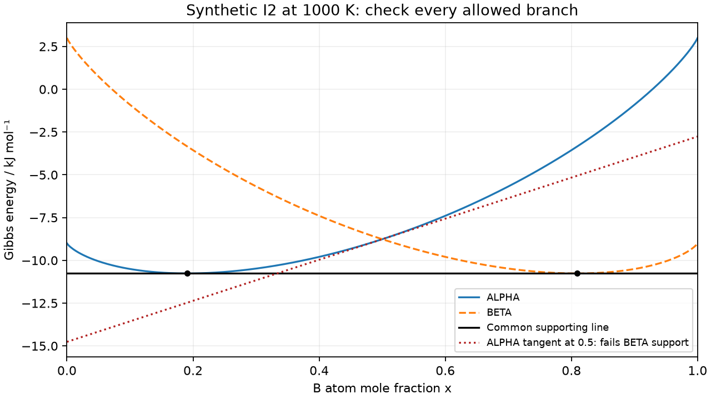

# Lesson 6 — addition, exchange and the common tangent

Meetings 14–15, followed by Clinic B (meeting 16). Prerequisites:
[ideal mixing](lesson_04_ideal_mixing.md), [balanced splits](lesson_05_two_phase.md),
slopes as rise/run and a straight line y=c+mx. Derivatives are introduced here;
prior multivariable calculus is not assumed. Use the [worksheet/clinic](lesson_06_worksheet.md)
and [instructor guide](../instructor/lesson_06_guide.md).

Exit goal: state what a derivative holds fixed, distinguish addition from
exchange, identify both chemical potentials from one tangent, and check all
allowed phase branches before claiming equilibrium. The physical model remains
synthetic I2, T600–1800 K, p100000 Pa, amounts in moles of atoms, with interfaces,
strain and kinetics omitted. The [binary-family contract](binary_family_contract.md)
defines the scope and standard thermodynamic sources.

## 6.1 A slope describes a specified change

For a function F(u), a finite difference [F(u+h)−F(u−h)]/(2h) compares nearby
states. As h becomes small, a resolved value approximates the derivative dF/du.
Use multiple h values: smaller steps reduce truncation error at first, but very
tiny differences can lose digits in floating-point subtraction. “Use the smallest
possible h” is not a numerical accuracy argument.

Write **total** Gibbs energy for one homogeneous phase as

$$G(n_A,n_B)=(n_A+n_B)g(x),\qquad x=\frac{n_B}{n_A+n_B}.$$

G has units J, nA/nB mol; g is J/mol of all atoms. There are two independently
variable amounts. Changing either amount generally changes both total n and x.
Chemical potential μB is the change in total G per small added amount of B at
fixed T,p and nA. Similarly μA holds nB fixed. These are partial derivatives [1]:

$$\mu_B=\left(\frac{\partial G}{\partial n_B}\right)_{T,p,n_A},\qquad
\mu_A=\left(\frac{\partial G}{\partial n_A}\right)_{T,p,n_B}.$$

The subscript states what stays fixed, not what is added. The thought experiment
is open for that small addition; it does not erase the closed-sample constraints
when phases later exchange matter internally.

## 6.2 Derive the distinction rather than rename a plotted slope

Start at nA=nB=0.5 mol: n=1, x=0.5. Add 0.01 mol B with A fixed. Now n=1.01 and
x=0.51/1.01≈0.5049505. Instead replace 0.01 mol A by B: n stays 1 and x becomes 0.51.
The two paths reach different states. A derivative with respect to x on a molar
curve follows an exchange path, not simply adding B to the original sample.

For an infinitesimal B addition dnB, dn=dnB and
$dx=(1-x)dn_B/n$. Expand the change in G=ng to first order:

$$dG=g\,dn+n g'\,dx=[g+(1-x)g']dn_B.$$

For an A addition, dn=dnA and $dx=-x\,dn_A/n$, giving

$$\mu_A=g-xg',\qquad \mu_B=g+(1-x)g'.$$

Here $g'=dg/dx$ at fixed T,p within one phase. For a fixed-total exchange of
dnB=−dnA, dx=dnB/n, so

$$\left(\frac{dG}{dn_B}\right)_{T,p,n}=g'=\mu_B-\mu_A.$$

Thus the molar-curve slope equals the **difference**, not μB by itself. The
identities also give g=(1−x)μA+xμB. For the ideal ALPHA branch at 1000 K, x=0.5:

| Quantity | J/mol |
|---|---:|
| g | −8763.172233 |
| μA | −14763.172233 |
| μB | −2763.172233 |
| g′ = μB−μA | 12000 |

A small B addition lowers G to first order here; exchanging B for A raises it.
Both signs can be correct because the changes have different constraints.
These derivatives are mathematical local responses of a homogeneous branch;
that branch need not be the globally stable state when other phases are allowed.

## 6.3 A tangent records both chemical potentials

At a point x0 on a smooth branch, its tangent is
$\ell(x)=g(x_0)+g'(x_0)(x-x_0)$. Rearrange:

$$\ell(x)=\mu_A+(\mu_B-\mu_A)x.$$

Its value at x=0 is μA, at x=1 is μB. These are intercepts of the **line**, not
the branch's pure endmember energies. The slope is μB−μA. At the worked x0=0.5,
ℓ(x)=−14763.172233+12000x J/mol. It meets the ALPHA curve at x0, but its extrapolated
value at x=0 is not gALPHA(0)=−9000 J/mol.

For two coexisting bulk regions that exchange A and B independently, a small
transfer of species i from α to β changes total G by (μiβ−μiα)dni. At an interior
minimum with both phases present, no first-order lowering in either transfer
direction requires μAα=μAβ and μBα=μBβ. Therefore the two tangents have equal
intercepts and slopes: a **common tangent**. Endpoints with absent components or
zero phase amounts require boundary reasoning, not division by a missing amount.

## 6.4 Tangency is not enough: the line must support all allowed branches

A supporting line lies on or below every allowed gφ(x) for all 0≤x≤1. For any
balanced candidate, if gr(xr)≥c+m xr for every region, then

$$g_{\rm sample}=\sum_r f_rg_r\ge \sum_r f_r(c+mx_r)=c+mz.$$

If a balanced split touches that line at every occupied region, it achieves this
lower bound. This proves it is a global minimum **within the declared model**.
The proof combines support and balance; equal chemical potentials alone do not
supply the global inequality. A grid plot by itself checks only sampled points.

Counterexample: ALPHA's tangent at x=0.5 lies below its own strictly convex branch.
At x=0.8 it is ℓ=−5163.172233 J/mol; BETA has g=−10760.595951 J/mol there, lower by
5597.423718 J/mol. This line fails support when BETA is allowed. Dropping BETA
silently changes the equilibrium problem. This example is a valid tangent to
one branch, not a claim that both branches share that invalid line.



## 6.5 Verify the special continuous I2 solution

For either ideal branch the supplied derivative formulas are

$$g'=d+RT\ln\frac{x}{1-x},\qquad
 g''=RT\left(\frac1x+\frac1{1-x}\right)>0,$$

where d=12000 J/mol for ALPHA and −12000 for BETA. Positive second derivative
means slope increases: each branch is strictly convex. Its tangent supports its
entire branch. Logs/derivatives are interior-only; g itself has finite pure limits.

Set ALPHA's slope to zero: ln[x/(1−x)]=−12000/(RT), hence
$x_\alpha=1/(1+\exp(12000/(RT)))$. Reflection gives xβ=1−xα. These minima have
the same energy, so a single horizontal line supports both entire curves.
At 1000 K, xα≈0.191040753, xβ≈0.808959247 and line g=−10762.730017 J/mol.
For z between these endpoints, the lever-rule split reaches the support bound.
Outside, homogeneous ALPHA on the A-rich side or BETA on the B-rich side is
selected. The executable checks also minimize g−line independently on both
closed branches, including endpoints, at the specified test conditions.

The horizontal tangent is a special symmetry of these invented references,
not a rule that coexisting phases always have zero slope. Add the same affine
reference a+bx to **every** phase: all balanced candidate energies shift by a+bz,
so amounts/compositions stay unchanged; μA shifts bya, μB bya+b and slope byb.
For a=432, b=−765 J/mol at fixed T, the formerly horizontal tangent has slope −765.
Shifting only one branch would instead change the model's phase competition.

## 6.6 Optional exact finite-difference cell

The cell spells out total G rather than differentiating an equilibrium solver.
It holds T=1000 K and ALPHA fixed. It prints step (mol), addition μB estimate
(J/mol) and exchange estimate (J/mol). Predict their signs first.

```python
import math

def total_G(nA, nB):
    n = nA+nB
    x = nB/n
    q = (1-x)*math.log(1-x)+x*math.log(x)
    return n*(1000-10*1000+12000*x+8.3145*1000*q)

for h in (1e-3, 1e-4, 1e-5, 1e-6):
    addition = (total_G(.5, .5+h)-total_G(.5, .5-h))/(2*h)
    exchange = (total_G(.5-h, .5+h)-total_G(.5+h, .5-h))/(2*h)
    print(f'{h:.0e} {addition:.6f} {exchange:.6f}')
```

Save to`/tmp/chemical_potential_cell.py`; from repository root run
`poetry run python /tmp/chemical_potential_cell.py`, or use the course notebook [f3](../../notebooks/f3_binary_mixing_potentials.ipynb) (section 3).
The last two addition estimates agree with −2763.172233 within 0.001 J/mol;
exchange agrees with 12000 within 0.001 J/mol. Displayed last digits may differ
by floating-point platform. No pure-endpoint derivatives are implied. The module
rejects exact endpoints or nonfinite derivative output rather than hiding them.
Paper route: use the numerical table and explicitly label the changed/held amounts.

## Vocabulary and sources

Partial derivative: rate of change with named other variables fixed. Addition:
one amount varies, the other remains fixed. Exchange: one rises as the other
falls at fixed total. Chemical potential: total-G addition derivative. Support:
line below every allowed state; not merely a visually plausible tangent.
All model parameters/examples are the [binary-family contract](binary_family_contract.md).
The derivative and support arguments above are shown explicitly, not inferred
from a solver status alone.

[1] IUPAC, “Chemical potential,” *Gold Book*, doi:
[10.1351/goldbook.C01032](https://doi.org/10.1351/goldbook.C01032),
[definition](https://goldbook.iupac.org/terms/view/C01032).
