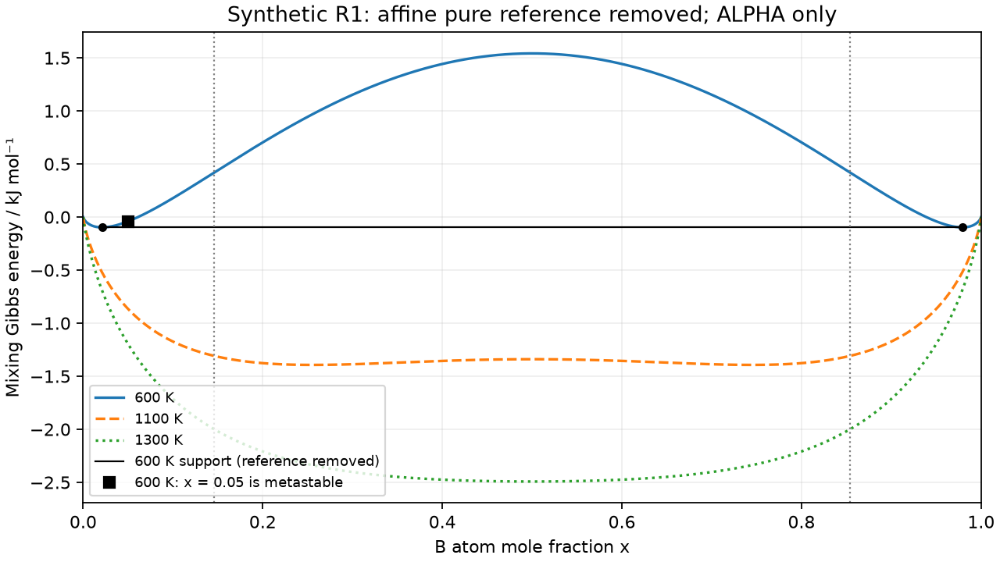

# Lesson 7 — nonideal mixing and local versus global stability

Meetings 17–18. Prerequisites: [mixing/reference terms](lesson_04_ideal_mixing.md),
[balances](lesson_05_two_phase.md), [chemical potentials/support](lesson_06_chemical_potential.md)
and Clinic B. Use the [worksheet](lesson_07_worksheet.md) and
[instructor guide](../instructor/lesson_07_guide.md).

Exit goal: explain the added enthalpy term, distinguish stable/metastable/unstable
homogeneous states, and reject a false zero-gap coexistence result. All examples
remain invented macroscopic bulk at fixed T,p=100000 Pa, closed A/B inventories,
with no interface, strain or kinetic model. Allowed T is 600–1800 K.

## 7.1 Change one declared term and the allowed phase set

Model R1 allows **ALPHA only**. It may form two macroscopic regions with different
compositions of this same phase structure. Do not rename one region BETA: BETA
belongs to the earlier I2 exercise and is excluded here. A region label L/R
means B-poor/B-rich composition, not a new crystal structure.

Keep ALPHA's references and R=8.3145 J/(mol K), then add one interaction term:

$$g=1000+12000x-10T+RTq(x)+\Omega x(1-x),\qquad
\Omega=20000\ \text{J/mol}.$$

This is the [contract's regular-solution form](binary_family_contract.md).
The constant positive Ω raises the energy of mixed compositions relative to the
ideal branch. It competes with the negative ideal entropy contribution to G:

$$\Delta h_{\rm mix}=\Omega x(1-x),\quad
\Delta s_{\rm mix}=-Rq,\quad\Delta g_{\rm mix}=\Omega x(1-x)+RTq.$$

The interaction vanishes at either pure endpoint and is largest at x=0.5.
Because Ω is independent of T, it adds enthalpy, not entropy. Total h still includes
1000+12000x; total s still includes 10. A negative Ω would favor unlike mixing in
this algebra, but is outside our fixed R1 coexistence dataset. No fitted elemental
interaction is implied. Later fitting trials are a separate parameter question.

Worked at x=0.5: Δh=5000 J/mol, Δs=5.763172 J/(mol K). At 600 K, Δg=1542.096660
J/mol; at 1300 K, Δg=−2492.123903 J/mol. The entropy benefit grows with T. A positive
mixing G relative to pure endmembers shows that complete homogeneous mixing is
unfavorable against that unmixed reference; its sign alone does not locate the
lowest-energy split or define every stability boundary.

## 7.2 Compare nearby balanced states before naming curvature

Take a homogeneous sample at composition z. Compare it with equal amounts at z−ε
andz+ε of the **same** ALPHA structure. Their average composition is z, so both
components remain conserved. The energy difference for small ε is approximately
$\tfrac12 g''(z)\epsilon^2$: the linear slope terms cancel by balance.
Thus a nonzero full slope does not by itself make a conserved homogeneous state
unstable. The curvature tests infinitesimal composition fluctuations:

$$g''=RT\left(\frac1x+\frac1{1-x}\right)-2\Omega.$$

Negative curvature means a small balanced separation lowers G: the homogeneous
state is **unstable**. Positive curvature resists these small perturbations but
does not establish the global minimum. A distant balanced split may still lower
G; then the homogeneous state is **metastable** in this thermodynamic sense.
No rate, lifetime, nucleation barrier or domain size is calculated here.

**Pause:** a solver finds a stationary point or small residual. Which question
remains? Whether another allowed balanced state has lower energy.

## 7.3 Two different pairs of boundaries

The **spinodal** marks where local curvature changes sign. Set g″=0 to obtain

$$x_{s,L/R}=\frac{1\mp\sqrt{1-2RT/\Omega}}2.$$

Real distinct values occur below the critical temperature
$T_c=\Omega/(2R)=1202.718143\ \mathrm K$. At/above Tc, curvature is nonnegative
everywhere (zero only at x=0.5 when T=Tc), and no finite miscibility gap remains.
This follows because x(1−x)≤1/4, so 1/x+1/(1−x)≥4. Energy properties still use
finite exact pure limits; endpoint derivative calls remain invalid.

The **binodal** endpoints are the globally coexisting compositions selected by a
supporting tangent. The interval between them is the **miscibility gap** for
homogeneous compositions: a balanced two-region state has lower G in its interior.
Because the non-reference mixing part is symmetric, xR=1−xL and

$$RT\ln\frac{x_L}{1-x_L}+\Omega(1-2x_L)=0,\quad0<x_L<x_{s,L}<0.5.$$

This is the derivative of the mixing part, or equivalently g′−12000, not the full
g′. The full supporting tangent has slope 12000 J/mol, never silentlyzero.
The ever-present x=0.5 root is the **central** root of this equation. Below Tc it
has negative curvature and is not a pair of coexisting compositions. Returning
xL=xR=0.5 would destroy the real gap even though the equation residual is zero.

## 7.4 A full worked stability classification at 600 K

The verified boundaries are:

| Boundary | B mole fraction |
|---|---:|
| binodal left xL | 0.021032752 |
| spinodal left xsL | 0.146047320 |
| spinodal right xsR | 0.853952680 |
| binodal right xR | 0.978967248 |

Outside the binodal interval, the homogeneous state is globally stable. Between
each binodal and neighboring spinodal it is metastable: positive curvature but
above a two-region mixture. Between spinodals it is unstable. At a boundary use
the appropriate equality/limit rather than classifying zero curvature as strictly
positive or negative. These are statements about homogeneous states, not a claim
that the lowest-energy equilibrium split is unstable.

At z=0.05: g″=65025.263158 J/mol>0, but homogeneous g=−4440.332994 J/mol is
56.864727 J/mol above its equilibrium split. This is metastable. At z=0.5,
g″=−20045.2 J/mol<0: unstable. At z=0.01, below the left binodal, homogeneous
ALPHA is stable. Each sample has a different overall inventory; its comparison
is always with other states balanced at that **same z**.

For z=0.5, the two regions have equal amounts at xL,xR. For other z between them,
fR=(z−xL)/(xR−xL), exactly the earlier lever balance. The full tangent is
ℓ(x)=−5097.197721+12000x J/mol at 600 K. The balanced equilibrium energy is ℓ(z).
The interaction/entropy expression is symmetric after subtracting the affine
reference, but the full g curve is tilted. Full g′(0.5)=12000, not zero.



The plotted vertical axis is **mixing Gibbs energy**, g−(1000+12000x−10T).
Subtracting that same affine function from every candidate preserves comparisons
at fixed z. Only in this displayed coordinate is the R1 supporting line horizontal.
It is not a graph of totalg. Vertical grey lines mark the 600 K spinodals. The dot at x=0.05 is above the 600 K supporting line
but on a locally convex part of the mixing curve.

## 7.5 Why the numerical result supports this narrow claim

A root finder is bracketed strictly below the left spinodal, excluding the central
root. The checked implementation compares noncentral endpoints to independently
computed 80/100-digit stored references at 600, 900, 1100 K and two temperatures close
to Tc. It checks the **gap**, both μ values, balances and global support as well as
the root residual. It rejects failed solver status and a central answer.

For a support check, examine g−ℓ on every branch including pure endpoints. Here
R1 has only ALPHA. Its derivative turning points are the two spinodals, so split
the interval there before searching each segment's minimum. This avoids treating
a multi-well curve as one unimodal search. The signs of the mixing derivative
show equal minima at the binodals and a central maximum of the **affine-subtracted**
curve, giving the supporting line; independent extrema/endpoints checks corroborate
that argument. Small residuals or a coarse plot alone do not establish it.

The contract deliberately supports automatic coexistence only for
T≤Tc(1−10⁻⁶). For Tc(1−10⁻⁶)<T<Tc it raises an explicit numerical-domain error;
it does not claim the physical gap vanishes. At/above Tc it reports one phase.
Property evaluation remains valid throughout 600–1800 K, including the narrow
unsupported near-critical coexistence band. These are numerical scope limits, not fitted physics.

## 7.6 Optional exact calculation

Run from the repository root in the existing Poetry environment. The output
columns are z, curvature (J/mol), homogeneous-minus-equilibrium G (J/mol). Predict
which signs correspond to stability before execution.

```python
from course.foundations.binary_family import (
    regular_properties, regular_derivatives, regular_equilibrium, regular_binodal)

T = 600.0
for z in (.01, .05, .5):
    g = float(regular_properties(T, z)['GM'])
    eq = regular_equilibrium(T, z)
    curvature = float(regular_derivatives(T, z)['curvature'])
    print(f"{z:.2f} {curvature:.6f} {g-eq['GM']:.6f}")
print('endpoints', *(f'{x:.9f}' for x in regular_binodal(T)['compositions']))
```

Save to `/tmp/regular_cell.py`; run `PYTHONPATH=. poetry run python /tmp/regular_cell.py`.
Expected middle row: `0.05 65025.263158 56.864727`.
Expected last row: `endpoints 0.021032752 0.978967248`.
Paper route uses the same table, line and balances; root-finder implementation is
not a hidden learner prerequisite. The older `regular_solution.py` is
not this implementation and is not covered by these checks.

## Vocabulary and source basis

Interaction parameter Ω: declared energy coefficient, J/mol. Spinodal: local
curvature boundary. Binodal: globally coexisting compositions. Miscibility gap:
overall compositions represented by two regions at equilibrium. Metastable:
locally resistant to small balanced fluctuations, globally above a split.
Unstable: small balanced fluctuations lower G. Critical point: the gap closes.
These standard forms and terminology follow the primary sources cited in the
[binary-family contract](binary_family_contract.md#primary-scientific-references);
the derivations/numbers here follow its original declared functions. No new
material assessment, atomistic mechanism or kinetic prediction is introduced.
