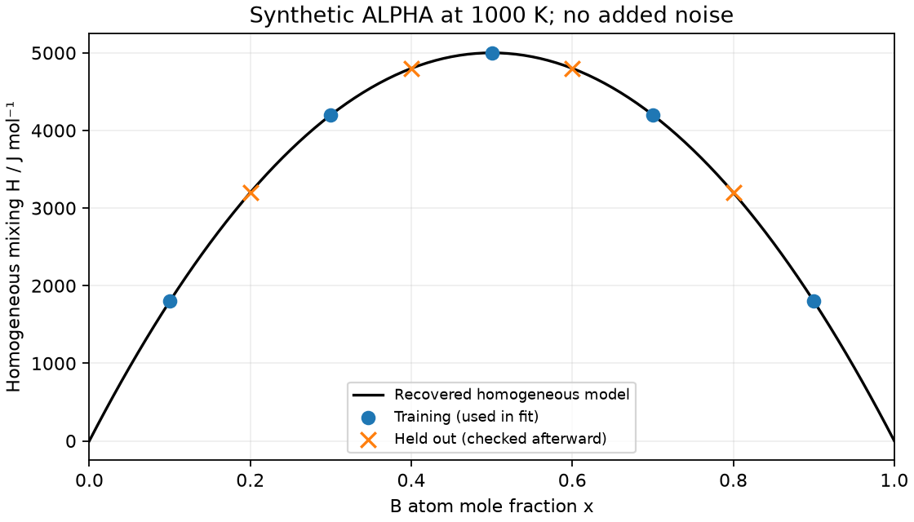

# Lesson 9 — fit one parameter to one declared observable

Meetings 21–22. Prerequisites: mixing versus total H, [homogeneous versus
equilibrium tool calls](lesson_08_binary_tools.md), sums/squares and plotting.
No statistical inference course is assumed. Use the [worksheet](lesson_09_worksheet.md)
and [instructor guide](../instructor/lesson_09_guide.md).

Exit goal: label observations, parameter, forward model, residuals and held-out
predictions; recover a known synthetic coefficient by hand and two code routes;
explain a parameter these observations cannot determine. This is not a real
CALPHAD assessment, uncertainty estimate or full ESPEI fitting workflow.

## 9.1 Freeze what was observed before choosing an optimizer

At T=1000 K, p=100000 Pa, our observable is **homogeneous ALPHA mixing enthalpy**
per mole of all atoms, evaluated at a supplied composition x. It is defined by
subtracting the same phase's unmixed pure enthalpies:

$$h_{\rm mix}(x)=h_{\rm ALPHA}(x)-[(1-x)1000+x13000]
=\Omega x(1-x)\quad\mathrm{J/mol}.$$

Homogeneous includes stable, metastable and unstable model states. It does not
mean “whatever G-equilibrium returns.” The [binary-family contract](binary_family_contract.md)
requires this observable in both forward routes. Pressure, temperature, reference
functions, ideal entropy and all other parameters stay fixed. The only fitted
quantity is Ω within [0,24000] J/mol.

The [original fixed data](binary_fit_data.json) were generated with Ωtrue=20000,
with no added noise. They are a recovery control: we know the answer on purpose.
They are not experimental observations of unstable material.

| Training x | 0.1 | 0.3 | 0.5 | 0.7 | 0.9 |
|---|---:|---:|---:|---:|---:|
| hmix, J/mol | 1800 | 4200 | 5000 | 4200 | 1800 |

Reserve x=0.2,0.4,0.6,0.8 for a later prediction check. Their stored values must
not enter estimation or guide parameter/model changes. Revealing the known
synthetic truth makes this an implementation exercise, not blind validation of
a physical model. A successful held-out check on the same generating equation
cannot establish real-alloy accuracy.

## 9.2 Define residuals with a sign and units

A **forward model** predicts hmix at supplied x and trial Ω. Define residual as
prediction minus observation: ri=Ωxi(1−xi)−hi, in J/mol. Minimize the unweighted
sum of squared residuals:

$$J(\Omega)=\sum_{i\in\mathrm{training}}r_i^2,
\qquad [J]=(\mathrm{J/mol})^2.$$

Do not confuse the objective J with the unit joule J; the surrounding expression
and units distinguish them. Positive residual means overprediction; squaring
removes its sign in the objective. A residual vector with opposite signs can
sum to zero and still have a large squared objective.

Worked trial Ω=18000 J/mol:

| x | Prediction | Observation | Residual | Squared residual |
|---:|---:|---:|---:|---:|
| 0.1 | 1620 | 1800 | −180 | 32400 |
| 0.3 | 3780 | 4200 | −420 | 176400 |
| 0.5 | 4500 | 5000 | −500 | 250000 |
| 0.7 | 3780 | 4200 | −420 | 176400 |
| 0.9 | 1620 | 1800 | −180 | 32400 |

The objective is 667600 (J/mol)². At Ω=22000 the residual signs reverse and the
same squared objective results. At 20000 every residual is zero. Changing x in
this exercise selects another observation; changing Ω changes the model used to
predict all observations. Equilibrium instead varied region compositions/amounts
at a **fixed model**, a different optimization question.

## 9.3 Solve this one-parameter example transparently

Let ai=xi(1−xi), a dimensionless sensitivity to Ω. Then J=∑(Ωai−hi)².
Differentiating this simple quadratic gives

$$\Omega_* = \frac{\sum_i a_i h_i}{\sum_i a_i^2}.$$

Here the denominator is 0.1669 and numerator 3338 J/mol, yielding 20000 J/mol,
inside the declared bounds. The positive denominator makes the unconstrained
quadratic minimum unique. Bounds would need attention if that minimizer fell
outside them; optimizer success alone would not make an inconsistent dataset fit.
For this fixed dataset the exact formula is an independent check on numerical
least squares [1]. No uncertainty interval follows from exact noiseless recovery.

The plain forward route computes total homogeneous H then subtracts 1000+12000x.
The tool route uses fixed-composition `calculate` through the checked wrapper,
records/validates actual x, and subtracts the same reference. The residual, units,
training split and Ω bounds are identical. Only the forward evaluator changes.

## 9.4 Check predictions after estimation, and reject a changed observable

After the parameter is fixed, the held-out comparison is:

| Held-out x | 0.2 | 0.4 | 0.6 | 0.8 |
|---|---:|---:|---:|---:|
| Prediction / stored value, J/mol | 3200 | 4800 | 4800 | 3200 |

Both executed routes return Ω=20000 in this environment and zero displayed
training/held-out residuals. The software check uses Ω error≤1e−5 J/mol and
held-out residual≤1e−6 J/mol, not an assertion that all floating-point work always
returns exact zero. Save solver status **and** actual parameter/residual values.

Wrong-observable control: at 1000 K, x=z=0.5, Ω=20000, homogeneous hmix=5000 J/mol.
The G-equilibrium mixture gives about 2810.686236 J/mol after the same overall
reference subtraction. The discrepancy exceeds 2000 J/mol. Even restricting the
phase list to ALPHA permits composition separation. Do not change the observation,
fit Ω to conceal this mistake, or move the temperature until the comparison passes.

A fit can be numerically converged and scientifically answer the wrong question.
Define the measured/modelled quantity first; use the optimization only afterward.



The line is the recovered synthetic equation; symbols distinguish the data roles,
not different physical observables. All values share the fixed homogeneous reference.

## 9.5 Observations cannot identify every parameter

At pure x=0 or 1, a=x(1−x)=0. Every Ω predicts zero mixing enthalpy there. Pure
endmember data alone leave J flat with respect to Ω: no unique estimate exists.
The helper rejects that input rather than returning an arbitrary starting value.
A nonzero sensitivity at interior x is necessary for this one-parameter recovery.

An optional thought experiment adds a temperature-dependent interaction
$g_{\rm excess}=(A+BT)x(1-x)$, with A in J/mol and B in J/(mol K). Then

$$h_{\rm excess}=g_{\rm excess}-T\frac{\partial g_{\rm excess}}{\partial T}
=A x(1-x).$$

The B term cancels. These homogeneous enthalpy data cannot identify B even if
many temperatures were added within that expression. All B values make identical
enthalpy predictions. Entropy-sensitive information would be needed; we do not
run or report a spurious two-parameter recovery. This algebra is an identifiability
illustration, not an authorized replacement of the fixed R1 model.

## 9.6 Optional exact cell

The helper has no held-out argument; the check is a separate call after fitting.
Read the residual definition in [binary_fit.py](binary_fit.py) before executing.
Run from the repository root in the existing Poetry environment:

```python
import json
from pathlib import Path
from course.foundations.binary_fit import fit_interaction, predict_hmix

data = json.loads(Path('course/foundations/binary_fit_data.json').read_text())
train = data['training']
for route in ('plain', 'tool'):
    fitted = fit_interaction(train['x_B'], train['H_mix'], route)
    print(route, f"omega={fitted['omega']:.6f}", f"SSE={fitted['sse']:.6f}")
    held = data['held_out']
    predicted = predict_hmix(fitted['omega'], held['x_B'], route)
    print('held-out', *(f'{y:.6f}' for y in predicted))
```

Save to `/tmp/binary_fit_cell.py`; run
`PYTHONPATH=. poetry run python /tmp/binary_fit_cell.py`.
Expected each route: `omega=20000.000000 SSE=0.000000`, followed by
`held-out 3200.000000 4800.000000 4800.000000 3200.000000`.
Paper route: use the residual table and quadratic formula, then predict the
held-out row. Learners need not implement the optimizer to explain the result.

## Vocabulary and sources

Parameter: an adjustable model coefficient. Observation: the precisely declared
quantity/data to match. Forward model: predicts that quantity at given conditions.
Residual: prediction minus observation. Objective: scalar criterion minimized.
Held out: excluded from estimation. Identifiable: distinguishable parameter values
produce distinguishable predictions in the supplied data. Recovery control:
known synthetic generating value, not material validation.

[1] SciPy developers, “scipy.optimize.least_squares,”
[official API](https://docs.scipy.org/doc/scipy/reference/generated/scipy.optimize.least_squares.html),
accessed 28 September 2026, no DOI listed for this page. SciPy reports half the
squared sum in its `cost`; this lesson's helper explicitly recomputes the full
sum J, so no factor-of-two convention is hidden. The quadratic solution and
identifiability cancellation above are derived here from the original
[binary-family contract](binary_family_contract.md), not inferred from optimizer output.
