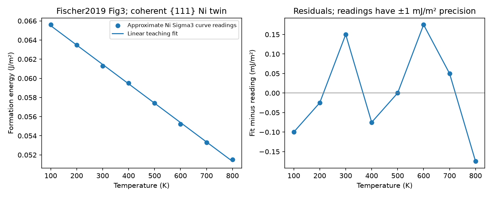

# Task 03 — a Ni twin curve, its fit and its area/site basis

**Notebook:** [task03_ni_twin](../../../notebooks/task03_ni_twin.ipynb) [](https://colab.research.google.com/github/ukerzel/CalphadIntro/blob/v0.1.0/notebooks/task03_ni_twin.ipynb): the same steps with try-first checks; locally `poetry run jupyter lab`.

Use this compact example after either primer or [Task 01](../cuni/README.md).
Read one published boundary-energy curve, fit a line and turn J/m² into
J/mol boundary sites. Then count a finite one-mole Ni cell without adding
the boundary atoms twice. Code, a factual curve excerpt, outputs and answers
are supplied.

## Source and numerical excerpt

F. Fischer, G. Schmitz and S. M. Eich, “A systematic study of grain boundary
segregation and grain boundary formation energy using a new copper–nickel
embedded-atom potential,” *Acta Materialia* **176** (2019), 220–231,
[DOI:10.1016/j.actamat.2019.06.027](https://doi.org/10.1016/j.actamat.2019.06.027).
Open **Figure 3, printed p.224 / PDF p.5**, and Section 3, printed p.222.
The selected branch is pure **Ni, coherent Σ3 {111} twin**; the source gives
its tilt-axis representation as [011]. The plane/character matters: another
Σ3 boundary or the high-angle Σ5 branch is a different input.

The [CSV](ni_twin_curve.csv) independently samples the **blue Ni Σ3 formation
energy band midpoint** at 100–800 K. It does not use the green internal-excess
energy, the Cu branch, the Ni–Cu difference or the brown switching-Hamiltonian
markers. These are samples of a Gibbs–Helmholtz integrated **EAM simulation
curve**, not experimental measurements or eight independent observations.
The source band propagates its 500 K reference uncertainty through integration.

For the inspected paper (SHA-256 recorded in the [results](ni_twin_results.json)),
page 5 was rendered to 1801×2400 pixels. Axis ticks give T=0 at x=246 and
T=800 at x≈806; γ=0 at y=933 and γ=0.08 at y=644. Read the blue band locally,
using adjacent visible line segments where brown markers obscure it. Curve
readings are rounded to **0.0001 J/m²**, with **±0.001 J/m² plot-reading
precision**. That precision is a graphical reading allowance, not a statistical
error bar, confidence interval or uncertainty on the original simulation.
Only these readings are included; no publisher text, figure or paper is redistributed.

## Fit and interpret

Fit $\gamma(T)=A+BT$ by unweighted least squares to those eight readings.
Report residuals as **fit minus reading** in J/m². This is a compact curve
representation within **100–800 K**, not a new boundary assessment.
No extrapolation, independent validation or uncertainty fit is assigned.

For this fixed-area linear teaching function, $-B$ is an entropy-like
coefficient in J/(m² K). The source computes excess entropy from its internal
and formation energies (Eq. 12) and includes mechanical/thermal-expansion
terms in its thermodynamics. Do not identify a graphical slope automatically
with an independently determined physical excess entropy.

## Count one mole and recover the boundary contribution

Choose **fixed teaching geometry**: FCC Ni lattice parameter $a=0.352$ nm,
equiaxed cubic grains of size $d=100$ nm, and one mole of total Ni atoms.
Neither fixed parameter reproduces the source's thermal expansion or box.
With four atoms per FCC unit cell and shared grain faces,

$$V_m=N_Aa^3/4,\qquad A_{GB}=3V_m/d.$$

The factor three counts six cube faces shared by two grains. Choose two
occupied {111} planes, one per adjoining grain, as the **site convention**:

$$\rho=\frac{2}{N_A}\frac{4}{\sqrt3a^2}\quad\mathrm{mol\ sites/m^2},\qquad
n_s=\rho A_{GB},\quad n_b=1-n_s.$$

There is one real Ni atom per occupied site. Boundary atoms are taken from
the total inventory; they are not added to one mole of bulk Ni. For the
same external bulk input as Task 01, evaluate pure FCC Ni only at **300, 500
and 800 K, 101325 Pa**, within the unary's lower support of 298.15 K. The
100/200 K source readings enter the area-curve fit only.

Use the fitted curve as a prescribed teaching offset:

$$\varepsilon(T)=\gamma(T)/\rho\quad\mathrm{J/mol\ sites},\qquad
g_s=g_{FCC}^{Ni}+\varepsilon,\qquad G_{cell}=n_bg_{FCC}^{Ni}+n_sg_s.$$

Thus $G_{cell}-g_{FCC}^{Ni}=A_{GB}\gamma$ on this one-mole basis. With zero
offset, the total is the original one-mole bulk energy. The full bulk function,
including magnetism, is copied once; no magnetic term is added separately.
The boundary area is prescribed by geometry: this calculation does not decide
whether a boundary forms or shrinks.

Combining an EAM formation-energy curve at no external pressure (source Eq. 7)
with a CALPHAD FCC reference at the lesson pressure is an **illustrative model
construction**. It is not a validated pressure transfer or a magnetic boundary
assessment. The code performs explicit energy/amount accounting; it does not
introduce a virtual-component phase model, solve a new equilibrium or discover
competing physical boundary states.

## Run and inspect

Use the [Task 01 source/download instructions](../cuni/README.md) and locked
Python 3.12 / pycalphad 0.11.2 environment. From the repository root:

```bash
mkdir -p /tmp/ni-twin-mpl
export MPLCONFIGDIR=/tmp/ni-twin-mpl MPLBACKEND=Agg
export OPENBLAS_NUM_THREADS=1 OMP_NUM_THREADS=1
(ulimit -v 2097152; timeout 120 poetry run python -m course.materials.boundaries.ni_twin --tdb /absolute/path/to/CuNi-92Mey-LB.tdb --output /tmp/ni-twin)
```

The [code](ni_twin.py) uses eight points, a 101-point line plot and three
pure-Ni evaluations. Time is capped at 120 s and address space at 2 GiB; no
dependency, download, database edit, phase diagram or atomistic job is needed.



[Results](ni_twin_results.json) record the fit, source/CSV hashes, site/area
amounts and recovered energies. Numeric recovery tolerances are $10^{-8}$ J/m²,
$10^{-7}$ J on the one-mole basis and $10^{-10}$ mol for balance. These checks
are separate from the plot-reading precision and any physical agreement claim.

## Short exercise

1. Identify the selected curve in Figure 3. Why are its eight samples not
   eight independent measurements? What do the green and brown series show?
2. Read A, B and the largest residual. Convert −B to mJ/(m² K), keeping its
   fixed-area teaching meaning separate from a physical entropy determination.
3. Calculate $V_m,A_{GB},\rho,n_s,n_b$. Which count is wrong if one uses all
   six cube faces without sharing? Why is $1+n_s$ mol Ni also wrong?
4. At 500 K, compute ε and the total boundary excess. Set γ to zero and
   explain the empty-offset result. Does exact recovery validate the EAM
   potential or the bulk-to-boundary construction?

[Answers](ni_twin_answers.md). [Day 2 D4](../../primer_day2/worksheet.md)
offers a simpler count exercise. D7's invented state competition remains an
optional illustration; no real Ni transition or further calculation is assigned.
