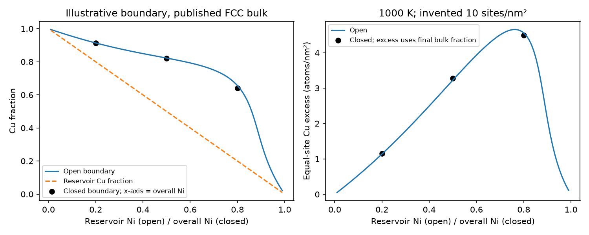

# Task 04 — Cu enrichment with an open or finite reservoir

**Notebook:** [task04_cuni_segregation](../../../notebooks/task04_cuni_segregation.ipynb) [](https://colab.research.google.com/github/ukerzel/CalphadIntro/blob/v0.1.4/notebooks/task04_cuni_segregation.ipynb): the same steps with try-first checks; locally `poetry run jupyter lab`.

Use this compact example after either primer or [Task 01 Cu–Ni](../cuni/README.md).
Couple the same published FCC bulk function to an **invented boundary** and
compare open exchange with a finite inventory. The code, parameters, outputs
and exercises are supplied. This completes an introductory mechanism exercise;
a measured, fixed-boundary Cu–Ni calibration remains outside this demonstration.

## What is published and what is invented?

The bulk is the unchanged Hallstedt-hosted Mey Cu–Ni input from Task 01;
its [source and download instructions](../cuni/README.md) identify the external
TDB and required hash. Use homogeneous **FCC_A1 at 1000 K and 101325 Pa**.
This is a conditional FCC calculation, not a new search over stable phases.
The vacancy sublattice is fixed bookkeeping, with one real metal atom per site.

Let $x$ be bulk Ni fraction and $y$ boundary Ni occupancy. Independently define
one fully occupied substitutional boundary state:

$$g_s(y)=g_b(y)+\delta y,\qquad \delta=6000\ \mathrm{J/mol\ boundary\ sites}.$$

The positive Ni-minus-Cu preference favors Cu at these sites. **The preference,
boundary-site fraction $f=0.02$ and density $\sigma=10$ sites/nm² are invented
teaching inputs.** They specify no physical boundary plane, angle or structure.
One atom occupies each site. On a one-mole total occupied-site basis, the bulk
has 0.98 mol and the boundary 0.02 mol sites. All areas are the total boundary
area associated with that capacity, with no hidden second-boundary multiplier.

Copying the full bulk function into this boundary is an explicit illustrative
assumption: unary, chemical and magnetic terms enter once, with the same atom
references. Do not add another magnetic term. The added preference is not a
measured absolute boundary energy, and no structural baseline or second state
is introduced. These boundary inputs were written for this course; only the
bulk function comes from the published database.

## Open exchange and closed balance

At fixed occupied sites, exchanging Cu for Ni uses **both** chemical potentials:

$$\mu_{Ni}-\mu_{Cu}=g_b'(x).$$

For an open reservoir fixing $x$, minimize the boundary grand potential

$$\phi(y)=g_s(y)-(1-y)\mu_{Cu}-y\mu_{Ni}.$$

Its stationary occupancy obeys $g_b'(y)+\delta=g_b'(x)$. For a purely ideal
bulk this becomes the familiar odds relation

$$\frac{y}{1-y}=\frac{x}{1-x}\exp[-\delta/(RT)].$$

The published bulk contains excess and magnetic terms, so the code solves its
full derivative equation; the ideal odds formula serves as a separate check of the code.
The script uses the pinned evaluator's $R=8.3145$ J/(mol K).

For a closed one-mole cell, fix the overall Ni fraction $z$ and minimize

$$\bar g=(1-f)g_b(x)+f g_s(y),\qquad z=(1-f)x+fy.$$

Now $x=(z-fy)/(1-f)$ must change as atoms exchange. The stationary exchange
equation is the same, but the bulk composition is no longer fixed. Check both
Ni and Cu inventories, rather than keeping the open reservoir composition.
The code brackets each scalar root on its feasible occupied-site interval;
it screens positive curvature at 101 compositions, without claiming a global
certificate or studying multiple phases/boundary states.

Under this chosen equal-site reference, the Cu excess is

$$\Gamma_{Cu}=\sigma[(1-y)-(1-x)]=10(x-y)\quad\mathrm{atoms/nm^2}.$$

Convert to mol/m² by multiplying by $10^{18}/N_A$, with
$N_A=6.02214076\times10^{23}$ mol$^{-1}$. Use the **final bulk $x$** in the
closed case. Occupancy, excess and absolute boundary energy are distinct.
This equal-site excess is not automatically a real boundary's Gibbsian excess.

## Run and inspect

From the repository root in the locked Python 3.12 / pycalphad 0.11.2 environment:

```bash
mkdir -p /tmp/cuni-gb-mpl
export MPLCONFIGDIR=/tmp/cuni-gb-mpl MPLBACKEND=Agg
export OPENBLAS_NUM_THREADS=1 OMP_NUM_THREADS=1
(ulimit -v 2097152; timeout 120 poetry run python -m course.materials.boundaries.segregation --tdb /absolute/path/to/CuNi-92Mey-LB.tdb --output /tmp/cuni-gb)
```

The [code](segregation.py) caps its plot at 101 open compositions and reports
three closed inventories, $z=0.2,0.5,0.8$. The Linux command caps address space
at 2 GiB and time at 120 s. Source hash/version are checked; no dependency,
download, TDB mutation, bulk fit or phase diagram is introduced.



[Saved results](segregation_results.json) include both component balances and
zero-preference/exchange checks. Fraction/balance tolerance is $10^{-10}$ and
exchange tolerance $10^{-6}$ J/mol sites. An independent finite-difference
check uses $10^{-3}$ J/mol with $h=10^{-6}$. These detect accounting/sign errors;
there is no physical-agreement tolerance, experimental fit or transition claim.

## Short exercise

1. Why does a positive $\delta$ lower the Ni occupancy? Why would subtracting
   $\mu_{Ni}$ alone from a filled boundary use the wrong exchange?
2. At $z=0.5$, read the open/closed occupancies. Calculate both closed component
   inventories from 0.98 mol bulk and 0.02 mol boundary sites. Where did Cu go?
3. Calculate the closed Cu excess using the final $x$. Explain why the excess
   can increase relative to the open result while the boundary Cu occupancy falls.
4. For a trial $x=0.5,y=0.3$, compute both excess units. With zero preference,
   what are open $y$, closed $x,y$ and excess? Which inputs would require
   measurements before this could be a physical boundary calibration?

[Answers](segregation_answers.md). The [Day 2 D5/D6 exercises](../../primer_day2/worksheet.md)
provide a simpler ideal A/B version.
