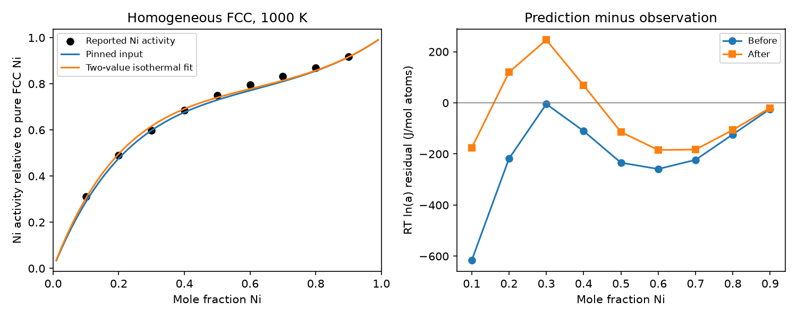

# Task 02 — fit two Cu–Ni interaction values at one temperature

**Notebook:** [task02_cuni_activity_fit](../../../notebooks/task02_cuni_activity_fit.ipynb) [](https://colab.research.google.com/github/ukerzel/CalphadIntro/blob/v0.1.3/notebooks/task02_cuni_activity_fit.ipynb): the same steps with try-first checks; locally `poetry run jupyter lab`.

Use this compact example after [Task 01](README.md) or either primer.
Read nine published Ni activities, improve a declared residual objective, and
explain what one temperature cannot determine. Code, data, exercises and answers
are supplied; learners fetch the same external TDB as Task 01. This is an
introductory calibration demonstration, not a new Cu–Ni assessment.

## Inputs and observable

The [data CSV](srikanth_jacob1989_ni_activity.csv) transcribes selected numerical
facts from S. Srikanth and K. T. Jacob, “Thermodynamic properties of Cu–Ni alloys:
Measurements and assessment,” *Materials Science and Technology* 5 (1989),
427–434, [DOI](https://doi.org/10.1179/mst.1989.5.5.427).
[Author-posted paper](https://www.researchgate.net/profile/Kallarackel-Jacob/publication/233719829_Thermodynamic_properties_of_Cu-Ni_alloys_Measurements_and_assessment/links/592e9ece0f7e9beee73eb889/Thermodynamic-properties-of-Cu-Ni-alloys-Measurements-and-assessment.pdf),
Table 1, printed p.429 / PDF p.3: EMF-derived Ni activity at **1000 K**, for
$x_{Ni}=0.1$ through $0.9$. No publisher figure/text/layout is copied.
Reported EMF and activity are preserved; recomputation with current constants
differs by up to 0.080 mV. Use the reported activities, not silently corrected
values. Rowwise activity uncertainties are absent. The Cu-activity column is
derived by Gibbs–Duhem integration and is not counted as another independent
measurement group. These pre-1992 observations are not independent validation
of the Mey model.

Evaluate **homogeneous FCC_A1** at each measured composition, at 1000 K and
101325 Pa (lesson pressure convention, not a reported experimental condition).
The model uses J/mol real atoms; the fixed vacancy sublattice adds no atoms.
Activity is relative to **pure FCC Ni at the same temperature**, including its
magnetic contribution. With $x=x_{Ni}$ and $g$ the molar Gibbs energy,

$$\mu_{Ni}=g+(1-x)\frac{dg}{dx},\qquad
a_{Ni}=\exp\left[\frac{\mu_{Ni}-g_{Ni}^{FCC}}{RT}\right].$$

The script uses pycalphad's $R=8.3145$ J/(mol K). No equilibrium calculation
replaces this phase/composition observable. Unary, ideal and magnetic terms
stay fixed. Only the two isothermal chemical interactions are adjusted:

$$\delta g=x(1-x)[\delta L_0+\delta L_1(1-2x)],$$
$$\delta\mu_{Ni}=(1-x)^2[\delta L_0+\delta L_1(1-4x)].$$

The sign comes from the source's $(x_{Cu}-x_{Ni})$ convention. Minimize the
unweighted sum of squared prediction-minus-observation residuals in
$RT\ln a_{Ni}$, measured in J/mol atoms. This is a linear least-squares problem
in the two corrections; it needs no iterative reassessment. Unweighted here
does not mean unweighted in activity itself or uncertainty-weighted inference.
The implementation uses [NumPy's least-squares solver](https://numpy.org/doc/stable/reference/generated/numpy.linalg.lstsq.html)
and recomputes the full residual sum explicitly.

## Run and inspect

From the repository root in the locked Python 3.12 / pycalphad 0.11.2 environment:

```bash
mkdir -p /tmp/cuni-fit-mpl
export MPLCONFIGDIR=/tmp/cuni-fit-mpl MPLBACKEND=Agg
export OPENBLAS_NUM_THREADS=1 OMP_NUM_THREADS=1
(ulimit -v 2097152; timeout 120 poetry run python -m course.materials.cuni.fit_activity --tdb /absolute/path/to/CuNi-92Mey-LB.tdb --output /tmp/cuni-fit)
```

The Linux command caps address space at 2 GiB and time at 120 s. No dependency,
network fetch, database edit/export or phase-diagram grid is introduced. The
[code](fit_activity.py) checks the unchanged Task 01 TDB hash before/after,
records the CSV hash, solves nine rows and plots 201 compositions. These are
values at 1000 K only; do not insert the fitted numbers as new temperature
functions in your database. In $L_k=A_k+B_kT$, one isotherm identifies only
$A_k+1000B_k$, not four separate coefficients.



[Saved numeric results](activity_fit_results.json) give fitted values, every
activity/residual, hashes and checks. The arithmetic check uses $10^{-7}$ J/mol,
pure-Ni activity $10^{-10}$, and synthetic coefficient recovery $10^{-5}$ J/mol.
These detect implementation mistakes; **there is no material-agreement tolerance**.
Residuals remain and some individual points worsen even though the total
objective improves. No experimental error bars, parameter confidence intervals
or physical validity are established.

## Short exercise

1. Why subtract pure FCC Ni at 1000 K? Why does the VA sublattice not add a
   second mole of atoms? Would an equilibrium mixture be the same observable?
2. At $x=0.5$, derive the correction to $\mu_{Ni}$ from $\delta g$ and its
   derivative. Use the JSON corrections to reproduce the hand-check value.
3. Read the before/after objective and the $x=0.3$ activity row. Does a better
   total fit guarantee improvement at every composition?
4. Show that replacing $A_k$ by $A_k+1000c$ and $B_k$ by $B_k-c$ leaves these
   observations unchanged. What extra information would determine temperature
   dependence? Is the present fit independent validation of the assessment?

[Answers](fitting_answers.md). For a simpler recovery exercise with invented
data, see the optional [Lesson 9](../../foundations/lesson_09_fitting.md).
