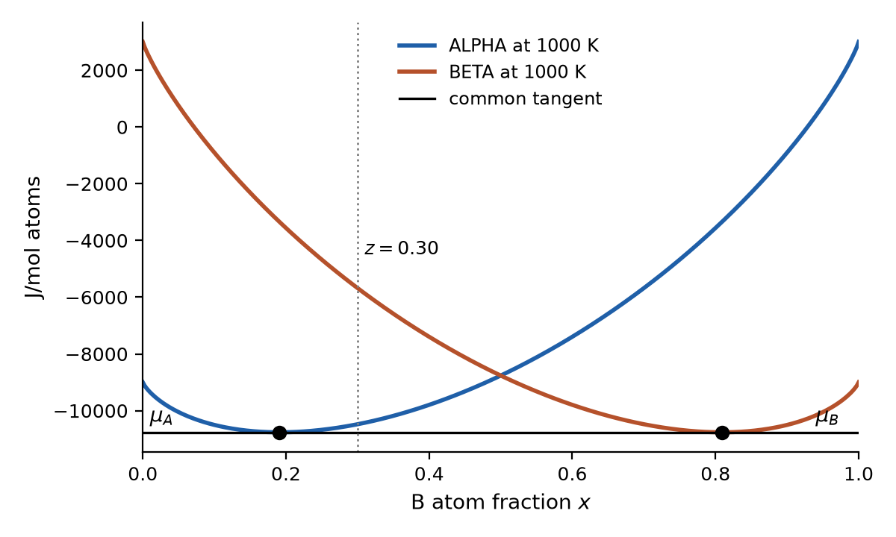
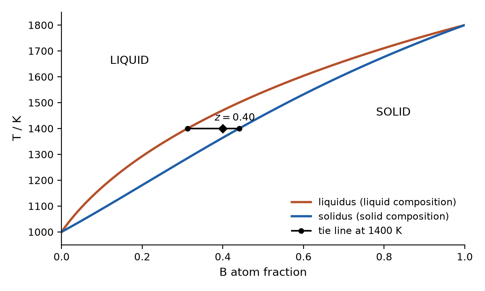
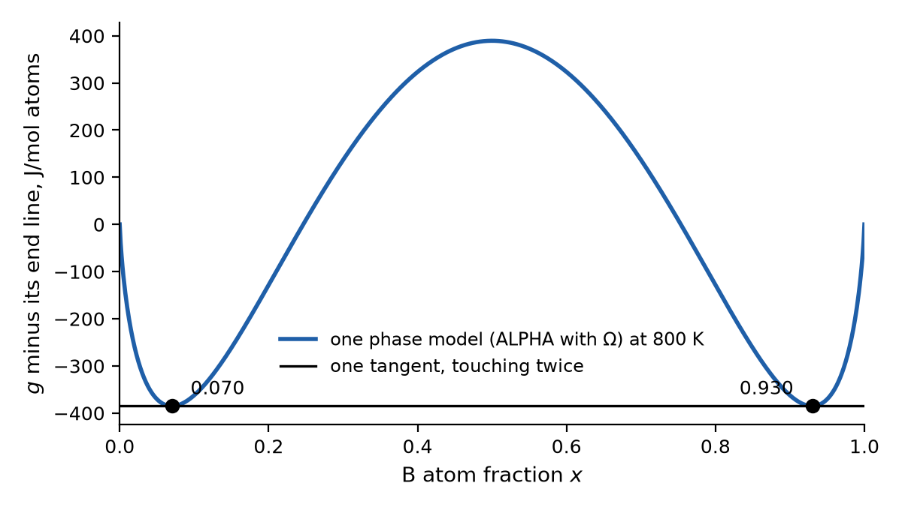

# Two phases: a recap sheet

Use this sheet before Task 01 or the advanced steps 07–18. It puts four pictures
together: the common tangent, the lever rule, the tie line with the
melting lens, and one phase model that forms two phases. You need Day 2's
D1 (counting A and B) and D3 (tangent end heights). Each part has one short
check; the answers are at the end. All energies are J/mol atoms, and $x$ and
$z$ are B atom fractions, as on Day 2. The longer version of this sheet is
self-study step 03, parts A–C.

## 1. The common tangent

Day 2's ALPHA and a second phase model, BETA (its mirror image), at 1000 K. A
sample whose overall B fraction $z$ lies between the two touching points does
better by splitting into ALPHA at $x=0.191$ and BETA at $x=0.809$ than by
staying in either phase. One straight line touches both curves: the
**common tangent**. As in D3, its end heights are $\mu_A$ and $\mu_B$, and
they are the same in both phases. In this mirror-image pair both equal
$-10762.7$, so the line is flat.

**Check 1.** At $z=0.30$, which single phase is lower, and is the split
lower still? Use $g_{\mathrm{ALPHA}}(0.30)=-10479.0$,
$g_{\mathrm{BETA}}(0.30)=-5679.0$ and the tangent height $-10762.7$.

## 2. The lever rule (you did this in D1 Q2)

The split must keep every atom: the amounts add to one, and the B atoms add
to $z$:

$$f_{\mathrm{ALPHA}}+f_{\mathrm{BETA}}=1,\qquad
0.191\,f_{\mathrm{ALPHA}}+0.809\,f_{\mathrm{BETA}}=z.$$

Solving gives the **lever rule**:
$f_{\mathrm{BETA}}=(z-0.191)/(0.809-0.191)$. The phase nearer to $z$ gets
the larger amount.

**Check 2.** Find $f_{\mathrm{ALPHA}}$ and $f_{\mathrm{BETA}}$ at
$z=0.30$, and check the B balance.

## 3. The chord rule

A split's energy is the amount-weighted sum of its two parts,
$G=f_1g_1+f_2g_2$. Drawn on the $g$–$x$ plot, that point lies on the
straight line (the **chord**) between the two dots, at $x=z$. Every split is
a chord, so the lowest energy at $z$ is the lowest chord, and the lowest
chord is the common tangent.

**Check 3.** Why can no split of this sample lie below the common tangent at
$z$?

## 4. Tie line and lens

The melting lens of step 03 part C: an invented solid and liquid in which A
melts at 1000 K and B at 1800 K. At 1400 K the common tangent touches the
liquid at $x=0.312$ and the solid at $x=0.441$. On a temperature–composition
diagram those two points are joined by a horizontal **tie line**. Repeating
this at every temperature traces the two lens curves. A sample on the tie
line splits: read the phase compositions at its ends, and the amounts with
the lever rule along it.

**Check 4.** At 1400 K and $z=0.40$, find $f_{\mathrm{SOLID}}$.

## 5. One phase model, two phases

Day 2's ALPHA plus an energy cost for unlike neighbours, $\Omega x(1-x)$
with $\Omega=20000$ J/mol, at 800 K (step 03 part B). The picture shows $g$
minus its straight end line: the touching points are the same, and the hump
is easier to see. One tangent touches the **same** curve twice, at 0.070
and 0.930. A sample in between splits into an A-rich and a B-rich region
with the same crystal structure. This is a **miscibility gap**: one phase
model, two phases.

**Check 5.** At $z=0.20$, what fraction of the sample is the B-rich region?

## Answers (after your attempt)

1. ALPHA is lower than BETA at $z=0.30$ ($-10479.0$ against $-5679.0$). The
   split is lower still: $-10762.7$, so about 284 J/mol atoms below ALPHA
   alone.
2. $f_{\mathrm{BETA}}=(0.30-0.191)/(0.809-0.191)=0.109/0.618\approx0.176$
   and $f_{\mathrm{ALPHA}}\approx0.824$. B balance:
   $0.824\times0.191+0.176\times0.809\approx0.157+0.142=0.30$.
3. Every split's energy lies on a chord between two points of the curves,
   and no part of either curve lies below the common tangent. So every
   chord, and every split, lies on or above it.
4. $f_{\mathrm{SOLID}}=(0.40-0.312)/(0.441-0.312)=0.088/0.129\approx0.68$,
   and the liquid is the remaining 0.32.
5. $(0.20-0.070)/(0.930-0.070)=0.13/0.86\approx0.15$; the A-rich region is
   about 0.85.
