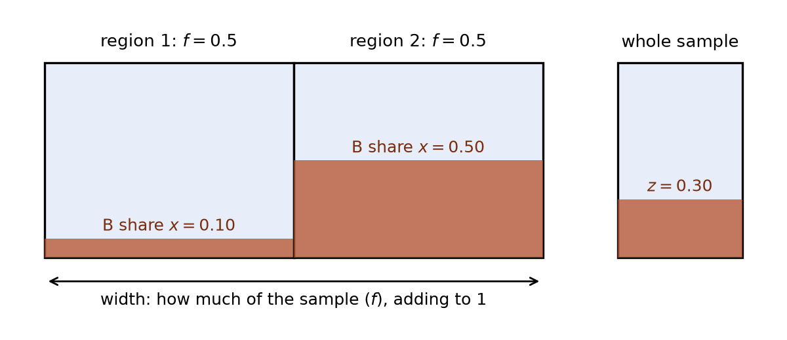
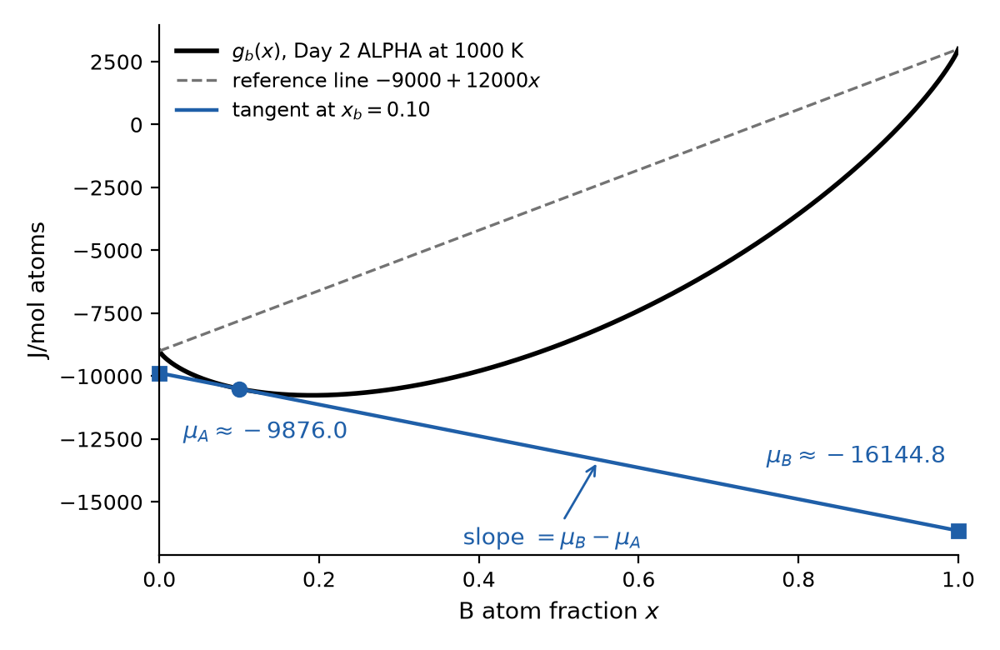
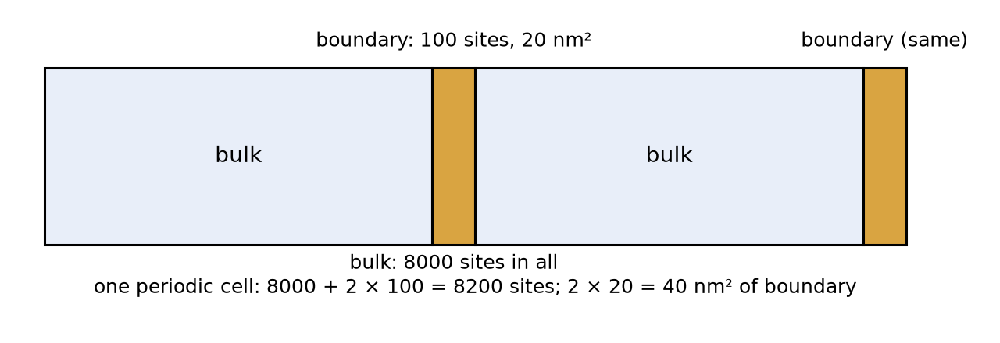
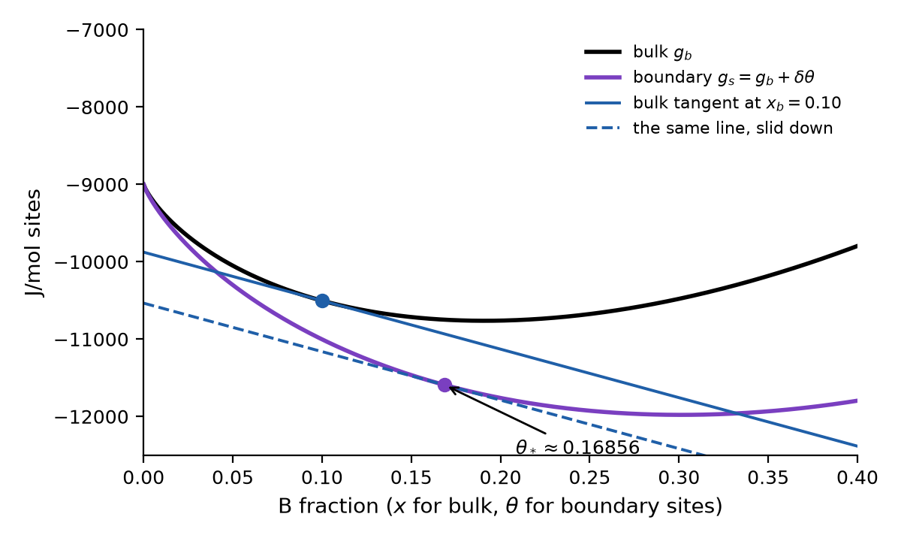
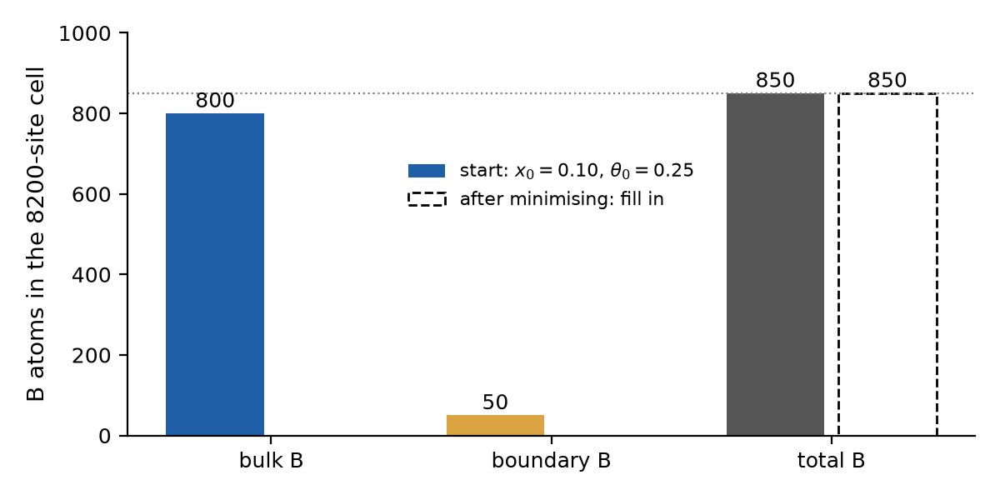
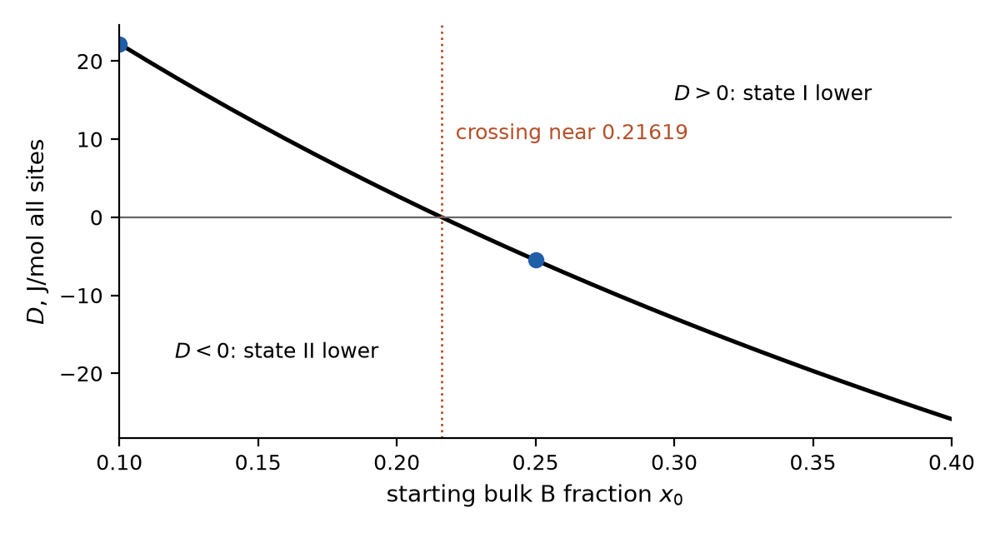

# Day 2 learner sheet — an invented bulk-to-boundary model

Keep the reference card at the end beside your work. Predict before uncovering
the [separate answer sheet](answers.md); mark any hint, partner help or supplied
result used. All required work is on paper. The numerical model is invented
A/B at $T=1000$ K and $p=100000$ Pa. It is **not** a Ni–Cu assessment.
Where a result is supplied, interpret and check it rather than claiming that
you ran a solver. Links to the detailed lessons behind each step are in the
[source map](source_map.md) for later study.

## D0 · Bridge from Day 1 (09:00)

> **In plain words.** Today adds a second kind of atom and a grain boundary, while Day 1's rules stay the same. You still minimize Gibbs energy at fixed temperature and pressure; what changes is what you must count. Picture: a chain of three boxes, bulk composition, boundary sites and competing boundary states.

Yesterday, fixed $T,p$ and one mole of invented A atoms let us compare two
unary $g(T)$ branches and minimize $G$ over allowed phase amounts. In the
research map, binary composition and a boundary were still missing. That map
said Ni–X; today X = Cu, but every number is still invented A/B.
Today B is a second invented atom species. We keep **one** invented bulk phase,
ALPHA, while learning the boundary bookkeeping. Its name does not identify
a real crystal structure. ALPHA's pure-A value at 1000 K, $-9000$ J/mol,
reuses Day 1's SOLID line $1000-10T$. Day 1's LIQUID ties with it at 1000 K,
but today we deliberately allow only ALPHA.

Draw a three-box chain: **bulk composition → boundary sites → competing
boundary states**. Under each arrow, write one quantity Day 1 lacked. Then
circle the claim that Day 1 did support: (a) A's invented SOLID/LIQUID lines
cross at 1000 K; (b) Ni–Cu segregates; (c) a boundary changes structure.

## D1 · Count A and B before choosing an energy (09:15)

> **In plain words.** Before any energy, count the atoms. The B fraction says what is inside one region, the phase amount says how much of the sample that region takes, and both balances must hold together. Picture: two boxes of different size, each labelled with how much B is inside it.

For a bulk containing $n_A$ and $n_B$ moles of atoms, define the B atom
fraction $x=n_B/(n_A+n_B)$; A's fraction is $1-x$. A *phase amount fraction*
is different: it describes how much material occupies a candidate region.
On our one-mole basis, $x=0.10$ means 0.10 mol B and 0.90 mol A, not ten
percent of image area and not yet ten percent of boundary sites. Keep the
same atom basis when comparing energies in J/mol.

**Worked count:** two bulk regions have phase amount fractions $f_1=f_2=0.5$
and B fractions $x_1=0.10$, $x_2=0.50$. Their overall fraction is
$z=f_1x_1+f_2x_2=0.30$. The A balance is
$f_1(1-x_1)+f_2(1-x_2)=0.70$.
This is a balanced *trial allocation*, not proof that the regions coexist in
equilibrium. The equilibrium comparison must also use their compatible Gibbs
energies and every allowed candidate. Our boundary example later restricts
the bulk to one ALPHA branch; it does not calculate which two bulk phases
could coexist, or at which compositions.

*The worked count as two boxes: the width of a box is its amount $f$, the
shaded part is its B share $x$. Together they make the sample's $z=0.30$.*

1. For 2 mol of atoms at $z=0.20$, find $n_A$ and $n_B$.
2. With $x_1=0.10$, $x_2=0.50$ and $z=0.20$, find $f_2$ from both fraction
   balances. Check that $f_1+f_2=1$.
3. Reject or repair: “The ALPHA composition $x=0.20$ means 20% of the
   sample's *area* is ALPHA.” What information is missing?

## D2 · One ideal bulk curve (10:00)

> **In plain words.** One curve now gives the Gibbs energy of the bulk at every composition. It is the straight line between the two pure ends, pulled down by mixing, so a mixed bulk is lower than its pure parts side by side. Picture: a rope sagging between two posts.

We use **the ideal ALPHA model** at 1000 K.
Its two pure-component endmember Gibbs energies are $g_A=-9000$ and
$g_B=3000$ J/mol atoms. Their difference is $12000$ J/mol. For an interior
composition $x$, with natural logarithm and $R=8.3145$ J/(mol K),

$$q(x)=(1-x)\ln(1-x)+x\ln x,$$
$$g_b(x)=-9000+12000x+8314.5q(x)\quad\mathrm{J/mol\ atoms}.$$

At a pure endpoint use the limit $0\ln0=0$; do not ask a calculator for
$\ln0$. The first two terms are the chosen reference energies; the last is
ideal *mixing Gibbs energy*. It is negative for $0<x<1$, even though this
ideal model's enthalpy **of mixing** is zero. That does not make total
enthalpy or total Gibbs energy zero. No measured alloy value is hidden here.

**Worked at $x=0.10$:** $q=-0.32508297$; hence the mixing term is about
$-2702.902$ J/mol and $g_b\approx-10502.902$ J/mol atoms. For one mole of
atoms, total $G\approx-10502.902$ J. For another amount, multiply by that
amount in mol; do not multiply J/mol by a raw atom count.

1. At $x=0.20$, use $q(0.20)=-0.50040242$ to find the reference term,
   mixing term and $g_b$. Why is $g_b$ not just $0.8g_A+0.2g_B$?
2. A report reads $-10.50$ **kJ/mol** and another reads $-10502.902$
   **J/mol** at $x=0.10$. Are they necessarily different models? State the
   conversion and whether the rounding supports equality at the printed
   precision.

## D3 · What exchanges when one B replaces one A? (10:45)

> **In plain words.** In a full crystal one B atom can only come in if one A atom leaves, so what counts is the difference μB − μA, the slope of the curve. Picture: the tangent at your composition; its two end heights are μA and μB.

At fixed $T,p$, the chemical potential $\mu_i$ is the change in total $G$
on adding component $i$ while the other component amount is fixed. At fixed
*total* occupied sites, replacing A by B changes $G$ with the difference
$\mu_B-\mu_A$, not with $\mu_B$ alone. Write $g_b'=\mathrm{d}g_b/\mathrm{d}x$
for the slope of the molar bulk curve. For a smooth curve the following hold;
today they are shown, not derived: $g_b'=\mu_B-\mu_A$ and

$$\mu_A=g_b-xg_b',\qquad \mu_B=g_b+(1-x)g_b'.$$

For this ideal ALPHA at interior $x$ the expressions simplify to

$$\mu_A=-9000+8314.5\ln(1-x),\qquad
\mu_B=3000+8314.5\ln x,$$
$$\mu_B-\mu_A=12000+8314.5\ln\frac{x}{1-x}.$$

At bulk B fraction $x_b=0.10$ (the $x$ of D1–D2; the subscript b marks the bulk, as in D4), the supplied values are $\mu_A\approx-9876.020$ and
$\mu_B\approx-16144.844$ J/mol atoms, so their difference is about
$-6268.824$ J/mol. A negative exchange difference is consistent with these
chosen references; it is not a universal statement that B atoms are
favorable at every boundary. A complete equilibrium also checks the stable
bulk phase under the imposed conditions. We use the ideal ALPHA model
conditionally.

*The tangent at $x_b=0.10$: its end heights are $\mu_A$ and $\mu_B$, and its
slope is $\mu_B-\mu_A$. $\mu_B$ lies far below pure B's reference value
(3000 on the dashed line) because a few B atoms among many A gain a large
mixing term, $RT\ln x$.*

*The advanced steps show these two heights coming out of an optimisation.*

1. Subtract the two supplied $\mu$ values and check the sign against
   $12000+8314.5\ln(0.10/0.90)$. Why would subtracting $\mu_B$ alone at a
   filled boundary be the wrong exchange accounting?
2. At $x_b=0.20$, use $\ln(0.20/0.80)=-1.38629436$. Is the exchange
   difference positive or negative? A sign change in this difference alone
   is **not** a bulk phase transition; explain why.

## D4 · Define the defect and its area basis (11:30)

> **In plain words.** A boundary is described by counting its sites and measuring its area. The extra B it holds is always measured against a bulk reference on the same number of sites, so keep sites, atoms and area apart. Picture: a slab of crystal with two thin boundary layers, each with its own count of sites.

Our invented periodic teaching cell has **two equivalent planar boundaries**
($n_{\rm gb}=2$). Each has $N_s=100$ occupied, substitutional sites and area
$a_{\rm gb}=20$ nm². The bulk has $N_b=8000$ occupied sites. Thus there are
200 boundary sites, 8200 total sites and 40 nm² total boundary area. Both
boundaries share mean B-site occupancy $\theta\in[0,1]$. These are average
counts that treat every boundary site alike; a single atomic snapshot would
have whole-number counts.

At bulk B fraction $x_b$:

| Region | B count | A count |
|---|---:|---:|
| Bulk | $8000x_b$ | $8000(1-x_b)$ |
| Both boundaries | $200\theta$ | $200(1-\theta)$ |

We choose an **equal-site excess**: subtract a hypothetical bulk reference
with B fraction $x_b$ filling the same 8200 sites. With Avogadro's constant
$N_{\rm Av}=6.02214076\times10^{23}$ mol$^{-1}$,

$$\Gamma_B=\frac{8000x_b+200\theta-8200x_b}
{(40\times10^{-18}\,\mathrm{m}^2)N_{\rm Av}}
=\frac{100(\theta-x_b)}{(20\times10^{-18}\,\mathrm{m}^2)N_{\rm Av}}.$$

The numerator is an **excess B count**; dividing by area alone gives
atoms/nm². (*Dive deeper, optional:* dividing by $N_{\rm Av}$ after converting nm² to m²
gives mol/m².) This convention assumes every site holds one atom, as in the
bulk; a real boundary with a different atom density may need a different
reference. Occupancy $\theta$ and excess $\Gamma_B$ are different.

**Worked trial:** $x_b=0.10$, $\theta=0.15$ gives 800 B in bulk and 30 at
both boundaries, versus 820 in the 8200-site reference. Excess is ten B
over 40 nm², or **0.25 atom/nm²**. It is not 30/20, which would combine
both boundaries' B count with one boundary's area.

1. Find both A counts and verify A atoms + B atoms $=8200$ for this trial.
2. If $\theta=x_b$, what is excess? If $\theta=0.08$ at $x_b=0.10$,
   compute its sign and atom/nm² value. Does negative excess mean a negative
   number of B atoms?

## D5 · An open reservoir selects one occupancy (13:15)

> **In plain words.** A boundary next to a huge bulk can swap A for B at the bulk's fixed prices. It takes B until one more B no longer pays. Picture: the bulk's tangent, and a parallel line touching the boundary curve.

Suppose a very large ALPHA bulk fixes $x_b=0.10$ and both chemical
potentials while A and B exchange with the two boundaries. Each B arriving
at a filled boundary replaces one A; the cell alone does **not** keep a
fixed B count. Define the invented boundary-site molar Gibbs function
$g_s(\theta)=g_b(\theta)+\delta\theta$, with preference
$\delta=-5000$ J/mol **boundary sites**. There is one candidate boundary
structure here and no structural baseline.

This is Day 1's W3 idea again: the conditions choose the potential. A
reservoir fixing $\mu_A$ and $\mu_B$ selects $g_s-(1-\theta)\mu_A-\theta\mu_B$
rather than $g_s$ alone. So for the open question minimize this *excess grand
potential* per mole of boundary sites, subtracting **both** component
reservoirs:

$$\phi(\theta)=g_s(\theta)-(1-\theta)\mu_A-\theta\mu_B$$
$$=8314.5\left[(1-\theta)\ln\frac{1-\theta}{1-x_b}
+\theta\ln\frac{\theta}{x_b}\right]+\delta\theta.$$

*Dive deeper (optional): how the second line follows from the first with D3's
formulas for $\mu_A$ and $\mu_B$. The rest of D5 uses the odds relation below.*

The first bracket penalizes departing from the reservoir occupancy; the
negative preference favors B. This one-state function curves upward
everywhere, so it has a single minimum, which obeys the A-for-B **odds**
relation

$$\frac{\theta_*}{1-\theta_*}=\frac{x_b}{1-x_b}
\exp[-\delta/8314.5].$$

For this declared preference, $\exp(5000/8314.5)=1.82459687$ is supplied;
no exponential key is required. At $x_b=0.10$, the selected
$\theta_*\approx0.16856026$. This is a site fraction, not a material
segregation measurement. The chosen equal-site excess is about
**0.342801 atom/nm²**, or $5.69235\times10^{-7}$ mol/m². The open cell
gains about $200(0.16856026-0.10)=13.7121$ B atoms relative to a
0.10-filled boundary; the reservoir loses that expected B count and takes
the exchanged A.

*The open boundary in one picture: slide the bulk's tangent down, keeping its
slope, until it touches the boundary function. The touching point is
$\theta_*$; how far the line moved is $\phi_*$.*

1. Use the supplied factor to calculate the odds and occupancy. Why is the
   equilibrium $\theta_*$ above $x_b$? What happens when $\delta=0$?
2. Reject: “The boundary has 0.16856 mol B, and $\phi_*$ is its absolute
   grain-boundary free energy.” Name both errors.

## D6 · A finite closed cell has a different balance (14:00)

> **In plain words.** Close the cell and the boundary can only gain B that the bulk gives up, so the bulk composition moves too. The answer differs from the open case even with the same functions, because something different is held fixed. Picture: a sealed box whose B atoms are shared between bulk and boundary, nothing entering or leaving.

Now close the **8200-site cell**: no atoms enter or leave, while heat still flows so $T$ stays fixed. Start with bulk
$x_0=0.10$ and both boundaries at $\theta_0=0.25$. Total B is
$8000(0.10)+200(0.25)=850$; total A is 7350. If boundary occupancy changes,
the bulk fraction must follow

$$x_b(\theta)=\frac{850-200\theta}{8000}.$$

The closed objective is the same cell's **total** energy,

$$G_{\rm cell}(\theta)=
\frac{8000g_b[x_b(\theta)]+200g_s(\theta)}{N_{\rm Av}}\quad\mathrm{J},$$

or its fixed-total-site normalization $\bar g=G_{\rm cell}N_{\rm Av}/8200$
in J/mol **all cell sites**. No reservoir subtraction belongs in this
closed energy. A numerical minimization of this exact invented cell,
cross-checked with the exchange condition, supplies $\theta_*\approx0.1716075$ and
$x_b(\theta_*)\approx0.10195981$. They are **supplied model results**;
we check their balance on paper rather than pretending to have reproduced
the solver. The closed occupancy differs from D5's fixed-reservoir result.

1. At trial $\theta=0.35$, calculate $x_b$, bulk B and boundary B; check
   the total. Reject a report that keeps $x_b=0.10$ for this trial.
2. With the supplied selected pair, estimate bulk and boundary B counts.
   Why must a comparison between two closed states use the *same* total B
   even if their final $x_b$ values differ?

*The closed cell's B ledger. Fill in the dashed bars from your answer to
question 2: the total must stay at 850.*

## D7 · Compare two boundary structures on one basis (14:45)

> **In plain words.** To compare two boundary structures fairly, give both the same atoms, the same sites and the same reference, and let each find its own best occupancy. Only then does the lower total energy pick a structure. Picture: two identical sealed cells side by side, the same atoms inside, one structure in each.

This follows Day 1's CALPHAD logic: **define the Gibbs functions, evaluate
every allowed candidate, then minimize subject to the physical constraints**.
Giving a candidate a phase name in a database would not supply missing
parameters or validate its physical identity. Here the functions are printed
explicitly, so the paper route can focus on what a state comparison means.

Our candidate **boundary states** I and II share $T,p$, the 8000 bulk sites,
two equivalent 100-site/20-nm² boundaries, atom references, area and the
same one-phase ALPHA bulk. Both are uniform alternatives for the two
boundaries, not a model of coexisting domains. Their site functions are
$g_{s,i}(\theta)=g_b(\theta)+\eta_i+\delta_i\theta$:

| State | Baseline $\eta_i$, J/mol boundary sites | Preference $\delta_i$, J/mol boundary sites |
|---|---:|---:|
| I | 0 | −5000 |
| II | +2000 | −10000 |

The +2000 baseline must enter State II's total energy even though it does
not change its best occupancy at a fixed inventory. On the all-site basis
it contributes $200(2000)/8200=48.78049$ J/mol **all sites**. For each
starting bulk $x_0$, both alternatives start with $\theta_0=0.25$, hence
share $B_{\rm tot}=8000x_0+50$; then *each* state is minimized separately.

**Supplied checked model results** (energies include State II's baseline):

| $x_0$ | Shared B total | State I: $\theta_I^*$, $\bar g_I^*$ J/mol all sites | State II: $\theta_{II}^*$, $\bar g_{II}^*$ J/mol all sites |
|---:|---:|---|---|
| 0.10 | 850 | 0.1716075, −10541.72679 | 0.2689826, −10519.50695 |
| 0.25 | 2050 | 0.3742813, −10713.32958 | 0.5170377, −10718.80845 |

Define $D=\bar g_{II}^*-\bar g_I^*$ **at the same $x_0$**. Positive $D$
selects I among these two uniform candidates; negative $D$ selects II.

*Dive deeper (optional):* the full synthetic model has a uniform-branch ordering crossing near
$x_0=0.21619$. That model number alone is **not** evidence for a real
interface phase transition: mixed-boundary coexistence, structural
identification, appropriate excess thermodynamics, kinetics and material
evidence are absent.

1. Subtract the supplied energies for both rows; state the favored candidate.
   Why must we not compare State I at $x_0=0.10$ to State II at $x_0=0.25$?
2. For the first row, compute State II's bulk B count from its occupancy
   and verify the shared total 850. Explain why forcing both states to the
   *same final* bulk fraction would violate at least one balance.
3. A report omits $\eta_{II}$ but keeps the printed State II energy. Name
   the inconsistency and convert the missing baseline to the all-site basis.

*After question 1: $D$ for every starting bulk fraction of the synthetic
model. The two marked points are the table's rows; where $D$ crosses zero the
lower uniform candidate changes. This says nothing about a real interface
transition.*

## D8 · What would make this a material case? (15:30)

> **In plain words.** A toy calculation shows how a real question could be answered, not the answer itself. A claim about a real material needs a matched bulk model, boundary data and an independent check, one after the other. Picture: a ladder of evidence, every rung needed before the claim at the top.

*Optional (discussion): skipping it changes no calculation of the day.*

CALPHAD uses thermodynamic models and evidence to compare allowed phases
under stated conditions. The form of our toy calculation suggests a research
route, not a right to insert arbitrary real-material parameters. The worked
examples (Tasks 01, 03 and 04) supply a published Cu–Ni bulk database and a
simulated energy curve for one pure-Ni twin boundary, but **no matched real
Ni–Cu boundary dataset**: no specified Ni–Cu boundary with measured composition
or excess, and no boundary model fitted to such data.

| Step | Evidence needed before a real claim |
|---|---|
| Case and source | Exact alloy, observable, boundary geometry, and a source we may use |
| Bulk model | Complete compatible bulk phase model, references/range and stable $\mu_A,\mu_B$ |
| Boundary model | Matched boundary sites/area/state free energies or excesses, conditions and independent evidence |
| Calculation and comparison | A planned physical/numerical run with inputs we may use, conservation checks, comparison with data not used to build the model, and a check by someone else |

Sort these statements into **toy-model result**, **missing evidence**, or
**unsupported real claim**: (a) State I is lower at the 850-B toy cell;
(b) a validated Ni–Cu bulk model with a stable reservoir at the case point;
(c) Ni–Cu boundaries switch structure at $x_0=0.21619$;
(d) two compatible real boundary-state free-energy functions measured from
one common reference (including the same stress state). If only one real
state were validated, what narrower
question might be asked? Why do two states and an energy crossing still need
an interface coexistence analysis for a physical transition claim?

## D9 · Integrate on a fresh card (16:00)

> **In plain words.** This section uses the whole day once more on new numbers, without new ideas. Keep the open and the closed question apart: they start from the same number but hold different things fixed. Picture: two cards side by side, one open to a reservoir, one sealed.

*Dive deeper (optional practice): the day's ideas on fresh numbers.*

Use the **same invented parameters** at a new open reservoir $x_b=0.20$.
The supplied factor remains 1.82459687. Separately, consider a new
**closed** 8200-site cell with $x_0=0.20$, $\theta_0=0.20$ and trial
$\theta=0.40$. These are different experiments, even though both start
with the number 0.20.

1. Open: calculate $\theta_*$ from the odds relation and the selected
   equal-site excess in atoms/nm². Show the 40 nm² area check.
2. Closed: calculate total B, the trial bulk B count and final $x_b$.
   Reject “keep $x_b=0.20$ because the open reservoir did.”
3. A colleague calls the D7 crossing a measured Ni–Cu defect-phase
   transition and predicts a strengthening effect. Write two sentences:
   one supported toy-model statement and one exact missing-evidence reason.

## D10 · Supported exit (16:30)

> **In plain words.** This last section shows which ideas you can already use on your own and which still need support. Use it to choose your next task, not to collect a score. Picture: the four exit questions as steps you tick off, each with a note of any help you used.

Use this sheet and a calculator if helpful. State any hint or supplied output
used; the exit is for selecting next practice, not certification.

1. At fixed $T,p$, name the potential for our closed cell. State what is
   conserved in an open boundary exchange and in a finite closed cell.
2. With $x_b=0.10$ and **zero** preference, give $\theta_*$ and the
   equal-site excess. Why is this a model limit rather than a real observation?
3. At $x_0=0.10$ in D7, calculate $D$, name the lower uniform candidate,
   and list two missing conditions for a physical interface transition.
4. Name the worked example (Tasks 00–05) or detailed lesson you want to try
   next and a concrete question for it. Can the two primers alone validate a
   Ni–Cu prediction?

## Keep-beside-you reference card

| Symbol / rule | Meaning and basis |
|---|---|
| $x,z$ | Local and overall bulk B atom fractions, dimensionless |
| $g_b,G$ | Bulk Gibbs energy J/mol atoms; total Gibbs energy J |
| $R,T$ | 8.3145 J/(mol K), 1000 K in this invented Day 2 model |
| $g_b'=\mathrm{d}g_b/\mathrm{d}x$ | Slope of the bulk curve; equals $\mu_B-\mu_A$, the A-for-B exchange at fixed occupied sites, J/mol atoms |
| $x_b,\theta$ | Bulk B fraction and boundary B-site fraction; not area fractions |
| $N_b,N_s,a_{\rm gb},n_{\rm gb}$ | 8000 bulk sites; 100 sites and 20 nm² per boundary; $n_{\rm gb}=2$ boundaries |
| $N_{\rm Av}$ | $6.02214076\times10^{23}$ mol$^{-1}$; converts atom counts to mol |
| $\Gamma_B$ | Chosen equal-site B excess, $5(\theta-x_b)$ atom/nm² here |
| Open | Reservoir fixes $x_b,\mu_A,\mu_B$; cell A/B may exchange |
| Closed | Cell fixes $B_{\rm tot},A_{\rm tot}$; $x_b$ changes with $\theta$ |
| $\bar g,D$ | Closed energy J/mol all cell sites; $D=\bar g_{II}^*-\bar g_I^*$ at one inventory |

Useful supplied arithmetic: $\ln(0.10/0.90)=-2.19722458$,
$\ln(0.20/0.80)=-1.38629436$,
$\exp(5000/8314.5)=1.82459687$, and
$1\ \mathrm{nm}^2=10^{-18}\ \mathrm{m}^2$.
No solver or live internet is needed. The source/contract lineage and
optional detailed lessons are in the [source map](source_map.md).
